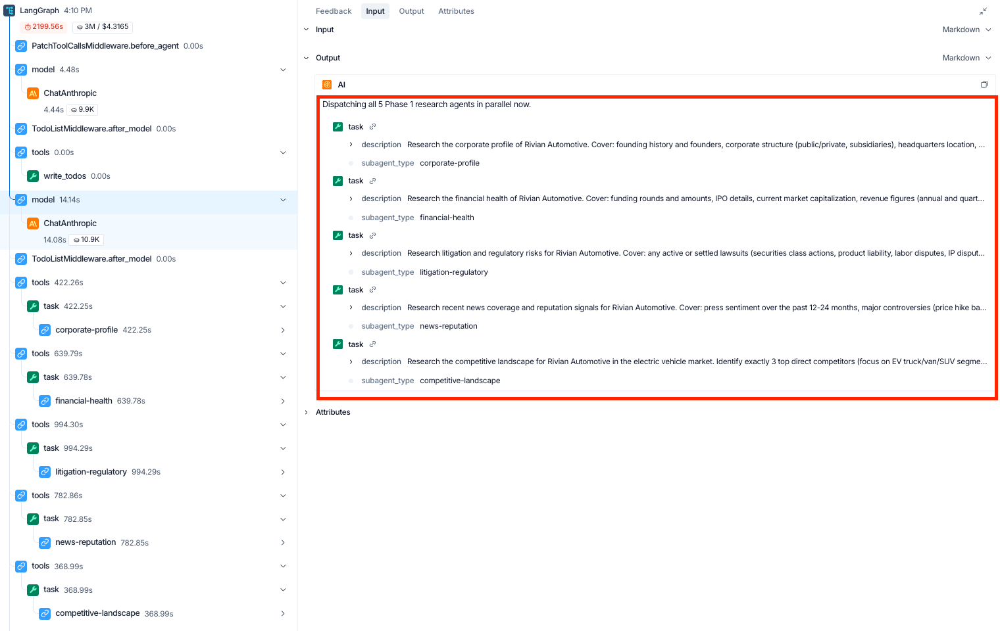
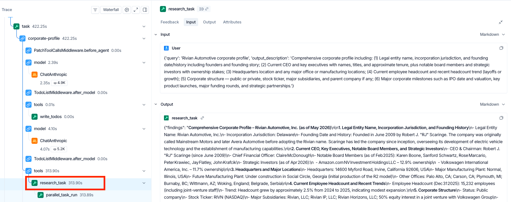
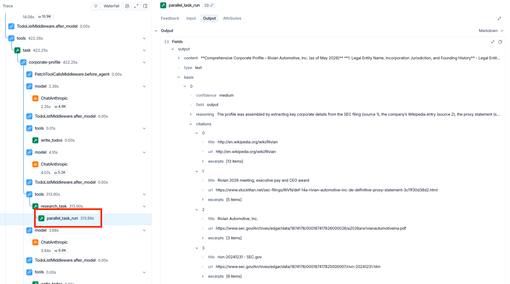

# Building a company due diligence agent with Deep Agents and Parallel

*Automate multi-step company research with agentic orchestration and structured web intelligence.*

- **Tags:** Cookbook
- **GitHub:** [parallel-cookbook/python-recipes/parallel-deepagents-due-diligence](https://github.com/parallel-web/parallel-cookbook/tree/main/python-recipes/parallel-deepagents-due-diligence)
- **Sample output:** [Rivian DD memo](reports/workpapers/rivian-due-diligence-report.md) and [eight workpapers](reports/workpapers/)

---

Company due diligence is a workflow that shows up everywhere in financial services. PE analysts screen deals, bank credit teams assess borrowers, compliance teams onboard new entities, insurance underwriters evaluate commercial policyholders. The research follows a consistent pattern. Take a company, investigate it across several dimensions, produce a structured intelligence report where every claim has a source trail.

This cookbook builds an agent that automates that workflow by combining LangChain's [Deep Agents](https://docs.langchain.com/oss/python/deepagents/overview) for orchestration and [Parallel's Task API](https://docs.parallel.ai/task-api/task-quickstart) for web research. Deep Agents handles planning, subagent delegation, and context management. Parallel handles the actual research, returning structured findings with per-field citations, reasoning traces, and calibrated confidence scores via [Basis](https://docs.parallel.ai/task-api/guides/access-research-basis). When findings from one track raise new questions, Parallel's [interactive research](https://docs.parallel.ai/task-api/guides/interactions) feature lets the agent chain follow-up queries with full context from the prior research thread.

## Overview

The agent orchestrates five research tracks, each handled by a dedicated subagent:

- **Corporate profile** — legal entity structure, key officers, founding history, headcount, office locations
- **Financial health** — funding history, revenue signals, valuation indicators, profitability markers
- **Litigation and regulatory** — lawsuits, SEC filings, sanctions screening, regulatory actions, settlements
- **News and reputation** — recent press coverage, leadership changes, controversy flags, media sentiment
- **Competitive landscape** — identifies the top three direct competitors and the target's positioning

Once `competitive-landscape` returns its named list, the orchestrator dispatches a separate `competitor-analysis` subagent **once per competitor**, in parallel — the canonical Deep Agents fan-out shape, with each instance running in its own isolated context. The orchestrator then reads every workpaper, cross-references for contradictions and low-confidence findings, runs ad-hoc lookups via Parallel's Search API when discrepancies surface, and writes the final report with risk flags and citation trails.

DD requires this multi-step architecture because earlier findings change what needs to be investigated next. If the corporate profile reveals the target is a subsidiary, the financial analysis needs to cover the parent. If the litigation scan surfaces an SEC investigation, the risk assessment changes. Deep Agents' planning tool lets the orchestrator adapt when findings shift the research plan.

Each research track uses a `pro-fast` processor Task API call. Validated end-to-end on Rivian Automotive (NASDAQ: RIVN): nine calls in ~23 minutes. See [Parallel pricing](https://docs.parallel.ai/getting-started/pricing) for current rates.

## Implementation

### Setup

```bash
uv pip install deepagents langchain-parallel langchain-anthropic
```

```bash
export ANTHROPIC_API_KEY="your-anthropic-api-key"
export PARALLEL_API_KEY="your-parallel-api-key"
```

### Defining the Parallel research tools

We define two tools. The first wraps Parallel's Task API for structured research with Basis-aware confidence handling. The second uses the LangChain integration's web search tool for quick factual lookups during synthesis.

```python
from typing import Optional

from langchain_core.tools import tool
from langchain_parallel import (
    ParallelTaskRunTool,
    ParallelWebSearchTool,
    parse_basis,
)


@tool
def research_task(
    query: str,
    output_description: str,
    previous_interaction_id: Optional[str] = None,
) -> dict:
    """Run structured web research via Parallel's Task API.

    Returns findings with per-field citations and confidence scores (Basis).
    Use previous_interaction_id to chain follow-up queries that build on
    prior research context.
    """
    runner = ParallelTaskRunTool(
        processor="pro-fast",
        task_output_schema=output_description,
    )
    invoke_args: dict = {"input": query}
    if previous_interaction_id:
        invoke_args["previous_interaction_id"] = previous_interaction_id

    result = runner.invoke(invoke_args)
    parsed = parse_basis(result)

    output = result["output"]
    findings = output.get("content") if isinstance(output, dict) else output

    response: dict = {
        "findings": findings,
        "citations_by_field": parsed["citations_by_field"],
        "interaction_id": parsed["interaction_id"],
    }
    if parsed["low_confidence_fields"]:
        response["low_confidence_warning"] = (
            "These fields came back with low confidence and should be "
            "verified, ideally by chaining a follow-up query with "
            "previous_interaction_id: "
            + ", ".join(parsed["low_confidence_fields"])
        )
    return response


# Quick search tool for fast factual lookups during synthesis
quick_search = ParallelWebSearchTool()
```

The tool does three things beyond a raw API call. It calls `parse_basis(result)` to extract per-field citations and the names of any low-confidence fields. It surfaces those names as an explicit `low_confidence_warning` in the tool's return value, so the calling subagent's reasoning loop can decide to chain a follow-up. And it returns the `interaction_id` so the chained call can anchor to the same research thread via `previous_interaction_id`.

### Defining the research subagents

Each research track gets its own subagent with a specialized system prompt and access to the `research_task` tool.

```python
corporate_profile_subagent = {
    "name": "corporate-profile",
    "description": "Research corporate structure, leadership, founding history, and headcount",
    "system_prompt": """You are a corporate research analyst.

Given a company, use the research_task tool to find:
- Legal entity name, incorporation state/country, founding date
- Current CEO and key executives (names, titles, approximate tenure)
- Headquarters location and major office locations
- Employee headcount (current and recent trend)
- Corporate structure (parent company, major subsidiaries)

For the output_description parameter, request these as structured fields.

If the result includes a low_confidence_warning, chain a follow-up query
using the returned interaction_id to verify the flagged fields.

Write your findings (including citations_by_field) to corporate-profile.md.""",
    "tools": [research_task],
}
```

The other Phase-1 subagents (`financial-health`, `litigation-regulatory`, `news-reputation`, `competitive-landscape`) follow the same shape with their own focused prompts. The full set is in [`agent.py`](agent.py).

The Phase-2 fan-out subagent is invoked once per competitor identified by `competitive-landscape`:

```python
competitor_analysis_subagent = {
    "name": "competitor-analysis",
    "description": "Produce a focused profile of one named competitor",
    "system_prompt": """You are a competitive intelligence researcher.

The orchestrator will pass you a single competitor name and the original
DD target. Make one research_task call requesting:
- Corporate snapshot (HQ, public/private, headcount, founding year)
- Most recent revenue and growth signals
- Funding or market cap status
- Product / positioning vs. the original DD target
- Recent strategic moves in the last 12 months
- Notable strengths and weaknesses relative to the target

Write your findings to competitor-<slug>.md.""",
    "tools": [research_task],
}
```

### Creating the orchestrator agent

The main agent coordinates the subagents, reviews findings for contradictions, and produces the final report. We back it with a [`FilesystemBackend`](https://docs.langchain.com/oss/python/deepagents/filesystem) so workpapers and the final memo persist to disk under `./reports/` rather than evaporating with the agent state.

```python
from pathlib import Path

from deepagents import create_deep_agent
from deepagents.backends.filesystem import FilesystemBackend

REPORTS_DIR = Path("./reports")
REPORTS_DIR.mkdir(parents=True, exist_ok=True)

diligence_instructions = """\
You are a senior due diligence analyst managing a team of specialized
researchers. Your job is to produce a comprehensive company intelligence
report with verifiable claims.

## Your Process

1. **Plan the research**: Use write_todos to lay out the diligence as a
   checklist. Phase 1 dispatches the five Phase-1 subagents. Phase 2
   dispatches one competitor-analysis subagent per competitor identified
   by competitive-landscape.

2. **Phase 1 — parallel research**: Use the task tool to dispatch
   corporate-profile, financial-health, litigation-regulatory,
   news-reputation, and competitive-landscape concurrently.

3. **Phase 2 — competitor fan-out**: Read competitive-landscape.md and
   parse the three named competitors. Dispatch a separate
   competitor-analysis subagent instance per competitor, in parallel.

4. **Review and cross-reference**: Read every workpaper. Look for
   contradictions, low-confidence findings, and gaps. Use quick_search
   for ad-hoc lookups during synthesis.

5. **Synthesize the report** with: executive summary, corporate profile,
   financial overview, litigation and regulatory risk assessment, news
   and reputation analysis, competitive landscape (with per-competitor
   sub-sections), confidence and verification notes, and key risk flags.

## Citation and Confidence Guidelines

- Include source URLs for key claims.
- Call out any finding where confidence was low. These need human verification.
- If two tracks produced contradictory information, note the discrepancy
  explicitly with citations from both sources.
"""

agent = create_deep_agent(
    model="anthropic:claude-sonnet-4-6",
    tools=[quick_search],
    subagents=[
        corporate_profile_subagent,
        financial_health_subagent,
        litigation_subagent,
        news_reputation_subagent,
        competitive_landscape_subagent,
        competitor_analysis_subagent,
    ],
    system_prompt=diligence_instructions,
    backend=FilesystemBackend(root_dir=REPORTS_DIR, virtual_mode=True),
)
```

### Running the agent

```python
result = agent.invoke({
    "messages": [{
        "role": "user",
        "content": "Conduct a full due diligence report on Rivian Automotive",
    }]
})

print(result["messages"][-1].content)
```

### Streaming execution progress

For long-running diligence runs, stream the agent's progress to see planning, tool calls, and subagent activity in real time. Pass `subgraphs=True` to receive events from inside subagent execution.

```python
for chunk in agent.stream(
    {"messages": [{"role": "user", "content": "Conduct a full due diligence report on Rivian Automotive"}]},
    stream_mode="updates",
    subgraphs=True,
    version="v2",
):
    if chunk.get("type") == "updates":
        source = f"[subagent: {chunk['ns']}]" if chunk.get("ns") else "[orchestrator]"
        print(f"{source} {chunk.get('data')}")
```

## Observability with LangSmith

### Why observability matters for FSI

Six months from now, a regulator examiner sits down to review one of the AI-assisted due-diligence memos your team produced this quarter, pulled from a portfolio of hundreds. They want to know which sources informed each conclusion, with what confidence, and whether the agent's process was logged. They expect an answer.

The agent compounds non-determinism (LLM output, prompt sensitivity, the open web), spends real money on real web research, and ends in a memo a regulator may eventually audit. Every claim has to map back to a primary source with an explicit confidence label, and that mapping has to remain auditable months after the run finishes. Once the agent reaches production, most of its failures surface there too, where pre-launch testing rarely catches them. The trace is the artifact that survives the run.

This is why the trace matters in FSI specifically:

- **Logging is increasingly mandated.** The EU AI Act requires automatic event logging for high-risk AI systems, and US bank regulators apply model risk management expectations to AI agents in practice even where formal scope is unsettled. The trace is the artifact both frameworks contemplate.

- **Decision explainability requires per-claim grounding.** When AI input feeds a regulated decision such as consumer credit, investment recommendations, or any process subject to fiduciary obligations, the institution has to explain how that input was formed. The basis payload (source URLs and per-output confidence) is what makes that explanation reproducible months after the run.

- **Third-party AI requires ongoing supervision.** The stack uses an external model provider (Anthropic) and an external research API (Parallel). Banking third-party risk guidance requires ongoing monitoring of vendor outputs beyond upfront due diligence. The trace records what each vendor returned, on what input, and with what confidence.

- **Operational resilience demands fast root-cause analysis.** Under DORA, in-scope EU financial entities must report major ICT incidents on tight windows. If an agent produces a faulty output that affects a client, the trace enables root-cause analysis fast enough to meet those obligations.

### How compliance and audit work today

FSI teams already have a system for proving how a research memo was produced: analyst workpapers, citation lists, email trails of source approvals, version control on the deliverable, and a compliance officer's review. For models specifically, banks add Model Risk Management documentation under SR 11-7, maintained in dedicated GRC tools.

This works because the analyst is the unit of accountability. When an examiner asks how a conclusion was reached, the analyst walks through their reasoning, with the workpaper and citation list backing them up.

AI agents break that model. The "analyst" is now a graph of LLM calls and tool invocations, and the reasoning lives inside context windows that disappear once the run ends. The trace restores the attach point, giving compliance the same inspectable record they had with human workpapers, with per-claim grounding added.

### What LangSmith captures

LangSmith records every Deep Agents step and every `ParallelTaskRunTool` invocation in this agent: the prompt the subagent constructed, the URLs Parallel returned, the basis payload with confidence, and the structured findings, with no changes to the agent code. Each run is also broken down into per-node cost across every model call, tool call, and subagent, so you can see exactly which step drove which share of tokens and time. When two runs come back at very different cost, the trace shows whether the difference lives in subagent reasoning, additional Parallel calls, or the final synthesis pass.

### What the trace shows

Open any run and the first thing you see is the orchestrator's plan: a four-phase TODO that lays out the research strategy before any subagent runs.


*Orchestrator's four-phase plan, generated by `write_todos` at the start of the run.*

Phase 1 then dispatches all five research subagents in parallel: `corporate-profile`, `financial-health`, `litigation-regulatory`, `news-reputation`, and `competitive-landscape`. Each subagent receives a focused mission described in plain English in the dispatch tool call. Click into any of those `task` nodes in the trace and you can see exactly what that subagent is doing: the prompt it issued, the Parallel calls it made, and the sources that came back.


*Phase 1 fan-out: five research subagents dispatched in parallel.*

After Phase 1 completes, the orchestrator fans out per-competitor analyses (Phase 2), cross-references workpapers for contradictions (Phase 3), and synthesizes the final memo (Phase 4). Every tool call is captured along the way.

Selecting any subagent's `research_task` shows the full structured findings Parallel returned: every field, every excerpt, and every URL, including content beyond the summary that lands in the workpaper.


*A subagent's `research_task` output: structured findings returned by Parallel.*

### Citations and confidence

For a compliance reviewer, the relevant view is the basis payload inside `parallel_task_run`. Parallel attaches each output with source URLs, a confidence label (high / medium / low), and a one-line reasoning trace explaining how the answer was assembled.


*Basis payload: source URLs, confidence label, and reasoning trace.*

In the Rivian corporate-profile call shown above, the agent's `medium`-confidence output is grounded in four sources: Rivian's 10-K and 2026 annual report on SEC.gov, a third-party reproduction of the 2026 proxy statement, and Wikipedia. That mix of two primary SEC filings, one secondary reproduction, and one tertiary source is exactly the kind of grounding pattern a compliance reviewer would want to flag. With the trace, the grounding is inspectable per claim, and sourcing patterns like this one become correctable across runs. A workpaper without this layer would list the same four URLs flat, with no signal about which were primary.

### Beyond a single trace

For one DD memo, the trace is the audit trail. For a portfolio of memos run across a quarter, you also need pattern discovery: which subagent produces the most low-confidence outputs, which targets force the most chained Parallel follow-ups, which sources have started returning thinner content. LangSmith builds on the trace foundation with cross-run analytics for exactly that. For an FSI team running diligence at scale, that capability turns an audit trail into an operating discipline.


## Who this is for

This architecture applies to any team running structured research workflows on companies, including deal screening, credit underwriting, KYB/KYC onboarding, M&A target evaluation, and vendor risk assessment.

The five research tracks here are a starting point. Swap in tracks relevant to your workflow: add management background checks and beneficial ownership tracing for compliance-heavy diligence, add IP portfolio analysis for M&A screening, add SOC 2 verification for vendor assessment. Each additional track is a new subagent dict with a system prompt and the same `research_task` tool.

## Resources

- [Full source code](https://github.com/parallel-web/parallel-cookbook/tree/main/python-recipes/parallel-deepagents-due-diligence)
- [Deep Agents documentation](https://docs.langchain.com/oss/python/deepagents/overview)
- [Parallel Task API](https://docs.parallel.ai/task-api/task-quickstart)
- [Parallel Basis and citations](https://docs.parallel.ai/task-api/guides/access-research-basis)
- [Parallel interactive research](https://docs.parallel.ai/task-api/guides/interactions)
- [`langchain-parallel` SDK](https://github.com/parallel-web/langchain-parallel)
- [Get a Parallel API key](https://platform.parallel.ai)
