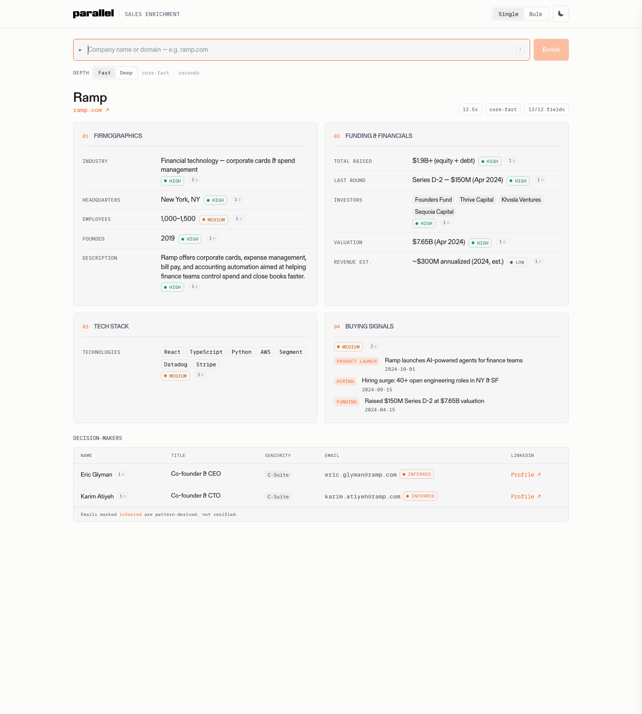

# Investor Signals + Sales Enrichment

[](LICENSE)

**A GTM intelligence stack built on the [Parallel](https://parallel.ai) Task & Monitor APIs**: two production-grade workflows that replace stale data-vendor subscriptions with live, cited web research:

1. **Investor Signals pipeline**: you pick the VC funds you want to track. Daily Parallel Monitors watch each fund for new AI-native investments (seed–Series B), verify every detection with a chained research task, check your CRM, score priority, and deliver a weekly Slack digest with warm-intro paths.
2. **Sales Enrichment app**: type a company, get a fully-sourced account brief in ~1 minute: firmographics, funding, tech stack, buying signals, decision-maker contacts. Every field traceable to the exact web page it came from. Bulk CSV mode included.

> **You bring the watchlist.** Nothing about which funds to track is hardcoded. You list your own in `monitor/investors.json` (gitignored, never committed). See [Choose the funds you track](#1-choose-the-funds-you-track).



## Why this exists

Data vendors ship you a **snapshot of a database**. This stack runs **live web research at request time**:

- **Fresh, not stale**: funding rounds and hiring surges from this week, not last year's crawl.
- **Grounded, not asserted**: every value carries citations with source excerpts. A value with no supporting citation renders blank: the backend **never fabricates** (enforced server-side, covered by tests).
- **Honest about uncertainty**: per-field confidence ratings; contact emails are either citation-backed or clearly labeled as inferred patterns, never "verified."

## What it shows

- **Task API with structured output + research basis**: per-field citations, excerpts, and confidence on every enriched value.
- **Monitor API (`event_stream`)**: one daily monitor per fund, cheap wide detection with structured, cited output.
- **The monitor → task chain**: each detected event is passed as `previous_interaction_id` to a follow-up Task that verifies it with fresh citations. Detection is tuned for recall; verification for precision.
- **Webhooks + Cron**: real-time push via a serverless receiver, or a scheduled weekly digest.
- A credibility rule, priority policy, and Slack formatting that are all **one source of truth**, shared across the CLI pipeline, the web app, and the serverless webhook.

---

## Setup for humans

Everything you need to run this locally, step by step. If you'd rather have a coding agent do it for you, hand it [`AGENTS.md`](AGENTS.md), a single paste-in prompt that sets the whole thing up (see [One-command agent setup](#one-command-agent-setup)).

### Prerequisites

- **Node ≥ 20** and **Python ≥ 3.12**
- A **Parallel API key**: create one at [platform.parallel.ai](https://platform.parallel.ai)
- *(optional)* a Slack incoming webhook, and an [Attio](https://attio.com) API key, for delivery + live CRM checks

### 0. Clone and install

```bash
git clone https://github.com/parallel-web/parallel-cookbook.git
cd parallel-cookbook/python-recipes/parallel-investor-signals

make setup          # venv + backend deps + dev tools + frontend deps + scaffolds .env
```

`make setup` copies `.env.example` to `.env`. Open `.env` and set at least:

```dotenv
PARALLEL_API_KEY=your_key_here      # server-side only; never exposed to the browser
DEMO_PASSWORD=pick-any-passphrase   # the app's access gate is CLOSED until this is set
```

Every variable is documented in [`.env.example`](.env.example). All optional integrations (Slack, Attio, webhook push, cron) degrade gracefully when unset.

### 1. Choose the funds you track

The watchlist is **yours**: the repo ships no baked-in list. Copy the example and edit it:

```bash
cp monitor/investors.example.json monitor/investors.json
```

```jsonc
// monitor/investors.json  (gitignored: your target list stays private)
{
  "investors": [
    "Sequoia Capital",
    "Andreessen Horowitz",
    "Your Fund of Interest"
  ]
}
```

List funds by the name they go by in the press. `monitor/investors.json` is gitignored, so your target list never lands in git. (You can also set an `INVESTORS="Fund A,Fund B"` env var, which overrides the file, handy in CI.)

### 2. Run the enrichment app

Two processes, two terminals:

```bash
make backend        # terminal 1 → FastAPI on http://localhost:8000
make frontend       # terminal 2 → Vite on  http://localhost:5173
```

Open **http://localhost:5173**, unlock with your `DEMO_PASSWORD`, and enrich a company (try `ramp.com`). Click any source marker to see the exact excerpt behind a claim. See [`project/README.md`](project/README.md) for the full app tour.

### 3. Run the investor-signals pipeline

```bash
source project/backend/.venv/bin/activate

python monitor/sweep.py                # once: 60-day backfill (monitors can't do history)
python monitor/monitors.py create      # once: one daily Parallel monitor per fund
python monitor/check.py                # any cadence: drain + verify new events → signals.json
python monitor/slack_notify.py --preview   # inspect the Slack format, dry-run
```

`check.py` is the recurring entry point: run it manually, via cron, or wire it to a scheduler. Full pipeline details, design decisions, and Slack conventions are in [`monitor/README-monitor.md`](monitor/README-monitor.md).

**Optional, label companies you already know.** To tag signals as "known" vs "net-new," derive a names-only list from any CRM/portfolio CSV export:

```bash
python monitor/build_portfolio.py data/your-companies.csv --name-col Company
```

The raw CSV (`data/`) and the derived `portfolio_names.json` are both gitignored; only a fictional example fixture is committed.

### 4. Run the tests

```bash
make test           # backend pytest + frontend vitest
make lint           # ruff over Python
```

---

## Architecture

```
                          ┌─ Sales Enrichment (on demand) ─────────────────────────┐
Browser ── /api/enrich ──▶│ FastAPI ─┬▶ Task run: ACCOUNT  (firmo · funding · tech)│
   ▲                      │          └▶ Task run: CONTACTS (concurrent)            │
   └── cited ResearchBrief◀───────────── merged, credibility-rule enforced ────────┘

                          ┌─ Investor Signals (continuous) ────────────────────────┐
Parallel Monitors (cloud) │ 1 event_stream monitor per fund on your watchlist, daily│
        │ events          └────────────────────────────────────────────────────────┘
        ▼
/api/signals/weekly-digest (Vercel Cron, Mondays)          /api/monitor/webhook (real-time, optional)
        │ strict 7-day gates → chained verification (previous_interaction_id)
        │ → CRM check (Attio) → priority score (stage/raise/fit)
        ▼
   ONE Slack message: every qualifying round, with sources + intro path + CRM link
```

Key design decisions, all covered by the test suite:

| Rule | Where |
|---|---|
| **Credibility rule**: no citation → `null`, never a fabricated value | `backend/parallel_client.py` |
| **Detection ≠ qualification**: monitors are recall-tuned; every event passes a chained verification task before it becomes a signal | `backend/investor_core.py` |
| **Strict date windows**: unparseable dates are excluded, never assumed fresh | `backend/signals_service.py` |
| **Priority policy**: Seed/Series A weighted over Series B ("rip-and-replace" territory), + raise size + product-fit rating | `investor_core.priority_for` |
| **Server-side access gate**: every `/api` route requires a passphrase; closed until `DEMO_PASSWORD` is set | `backend/main.py` |

## Repository map

```
├── project/                  # the web app
│   ├── backend/              #   FastAPI (Python)
│   │   ├── parallel_client.py    # ★ the only file that talks to Parallel (Task API)
│   │   ├── investor_core.py      # ★ signals pipeline core: schema, priority, Slack blocks
│   │   ├── signals_service.py    # signals surfaces + weekly digest job
│   │   ├── attio_client.py       # CRM pipeline checks (optional)
│   │   └── main.py               # routes, access gate, webhook receiver, cron endpoint
│   └── src/                  #   React + TypeScript + Tailwind
├── monitor/                  # the pipeline CLI (watchlist, monitors, sweep, drain, notify)
│   ├── investors.example.json    # sample watchlist: copy to investors.json and make it yours
│   └── config.py                 # watchlist loader + query/schema/processor tuning surface
├── tests/                    # backend unit + integration tests (pytest)
├── AGENTS.md                 # paste-in onboarding prompt for a coding agent
├── Makefile                  # make setup / dev / test / lint / build
└── .env.example              # every configuration variable, documented
```

## Configuration

All via environment (see [`.env.example`](.env.example)):

| Variable | Required | Purpose |
|---|---|---|
| `PARALLEL_API_KEY` | ✅ | Parallel API access (server-side only) |
| `DEMO_PASSWORD` | ✅ | Access-gate passphrase; the API is closed without it |
| `INVESTORS` | – | Comma-separated watchlist override (otherwise read from `investors.json`) |
| `SLACK_WEBHOOK_URL` | for Slack | Incoming webhook; unset = delivery quietly disabled |
| `APP_URL` | for Slack links | Deployed app URL for "Enrich →" deep links |
| `CRON_SECRET` | required for digest | Bearer auth for the weekly-digest cron; the route is **disabled (503)** until this is set (never public) |
| `WEBHOOK_SECRET` | required for webhook | Your Parallel **account webhook secret** (`whsec_…`); the receiver verifies the Standard Webhooks signature and **fails closed** without it |
| `ATTIO_API_KEY` | for CRM checks | Live CRM presence / associated-deal / owner lookups + record links (reference adapter) |

Beyond the watchlist, the two other tuning surfaces are the **priority thresholds** (`investor_core.STAGE_WEIGHT`, `priority_for`) and the **fit rubric**: the 1–10 prospect-scoring prompt (`investor_core.FIT_RUBRIC`). Adapt all three to your product and funds.

## Deployment (Vercel)

The app deploys as a static Vite build plus the FastAPI app running as a single Python serverless function (`project/api/index.py` re-exports it; `project/vercel.json` holds the routing, function limits, and cron schedule).

```bash
cd project
vercel deploy --prod --yes
# then add each required var for production, e.g.:
vercel env add PARALLEL_API_KEY production
vercel env add DEMO_PASSWORD production
```

To turn on real-time Slack pings from the deployed receiver (no cron, no polling):

```bash
# Set WEBHOOK_SECRET on the deployment to your Parallel account webhook secret
# (whsec_…, from Parallel → Settings → Webhooks), plus SLACK_WEBHOOK_URL, then:
python monitor/monitors.py set-webhook https://<your-app>.vercel.app
```

The receiver verifies the Standard Webhooks signature Parallel adds to every delivery and rejects anything unsigned or unverifiable, so no secret ever rides in the URL.

Notes:
- `maxDuration` is 300s. "Fast" lookups (~60–80s) fit comfortably; the deeper processor tier can exceed it.
- **Cron time is UTC.** `vercel.json` runs the digest at `0 15 * * 1` (15:00 UTC Monday). Vercel evaluates cron in UTC and does not track daylight saving, so pick the UTC hour you want rather than assuming a fixed Pacific time. The route also requires `CRON_SECRET`.
- **Bulk mode is local/self-host only.** Job state is in-memory and the work runs after the response returns, neither of which survives serverless instance hops, so the deployed backend refuses bulk (501) and the Bulk tab is hidden on deploys by default. Run it against a local or persistent backend (set `VITE_ENABLE_BULK=1` to re-expose the tab there).
- The webhook receiver runs research inline for simplicity; a production receiver should ACK 2xx immediately and process on a durable queue, deduping by `webhook-id`.
- The Signals UI tab is dev-only by default; set `VITE_SHOW_SIGNALS=1` at build time to expose it on a deploy. Slack is the intended production delivery channel.

## One-command agent setup

If you use a coding agent (Claude Code, Cursor, etc.), [`AGENTS.md`](AGENTS.md) is a self-contained onboarding prompt. Paste it into the agent from a fresh clone and it will: install everything, scaffold `.env`, help you set your watchlist, run the app, and, with your say-so, create the monitors and run the pipeline. It's the fastest path from clone to running.

## Documentation

- [`project/README.md`](project/README.md): web app details, project structure, walkthrough
- [`monitor/README-monitor.md`](monitor/README-monitor.md): pipeline architecture, design decisions, Slack conventions
- [`AGENTS.md`](AGENTS.md): paste-in agent onboarding

## License

[MIT](LICENSE)
