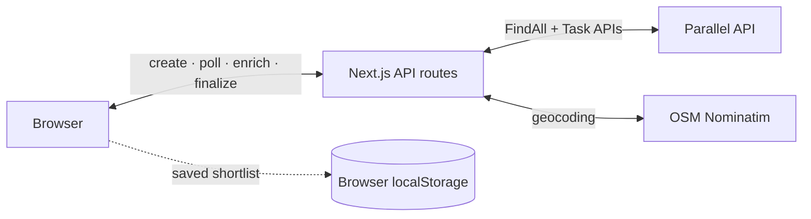

# Apartment Finder

Discover and verify real Bay Area apartment listings from a natural-language request with Parallel FindAll and Task. Live demo: [apartment-finder-web.vercel.app](https://apartment-finder-web.vercel.app)

## What it shows

- Discover individual listing pages with FindAll, then enrich each match into a structured 18-field record.
- Verify listings from untrusted sources with a separate Task run that checks fact-based scam signals.
- Drive a multi-step search from a Next.js client while keeping every serverless API request short and stateless.
- Geocode results, score them for price and location fit, and save a shortlist in browser storage.

## Architecture



The browser advances each search through short serverless calls. The application has no database or long-running server process; only the user's saved shortlist persists, in `localStorage`.

## Quick Start

### Prerequisites

- Node.js 20 or newer
- A [Parallel API key](https://platform.parallel.ai)

```bash
git clone https://github.com/parallel-web/parallel-cookbook.git
cd parallel-cookbook/typescript-recipes/parallel-apartment-finder
npm install
cp .env.example .env.local
```

Set `PARALLEL_API_KEY` in `.env.local`, then start the app:

```bash
npm run dev
```

Open [http://localhost:3000](http://localhost:3000).

## Deploy

Deploy this directory as a Vercel project and add `PARALLEL_API_KEY` to the project's environment variables.

```bash
npx vercel deploy --prod
```

> [!IMPORTANT]
> The `/api/search` and `/api/verify` routes do not authenticate callers. Every request uses your Parallel quota. Before a public deployment, add authentication and rate limiting, and keep `PARALLEL_API_KEY` in a server-side environment variable—never a `NEXT_PUBLIC_` variable.

## How it works

1. `POST /api/search` turns the user's request into explicit FindAll match conditions.
2. The client polls the FindAll run and renders confirmed listings as they arrive.
3. When discovery finishes, the client starts structured enrichment and polls again for price, beds, address, and other listing fields.
4. The finalize route geocodes and scores matches. Listings from untrusted sources can then be checked by the Task-based fraud verifier.

Configuration is environment-driven. See [`src/lib/server/config.ts`](src/lib/server/config.ts) for supported city, budget, generator, processor, and result-limit overrides.

## Project Structure

```text
src/
├── app/                 # Pages, layouts, and serverless API routes
├── components/          # Search, listings, map, and reasoning UI
├── hooks/               # Search state machine and saved targets
├── lib/server/          # Parallel client, parsing, scoring, and geocoding
├── providers/           # React context providers
└── types/               # TypeScript types
```

## Credits

Created by [Elijah Jacob](https://github.com/elijahgjacob) and contributed from [apartment-finder-web](https://github.com/elijahgjacob/apartment-finder-web).

## License

MIT. See [LICENSE](LICENSE) and [NOTICE](NOTICE).
