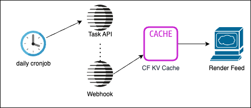

# Building an active monitoring service for public data

A very interesting pattern for tasks is doing tasks on a schedule. In this recipe it is shown how to schedule daily tasks, store results, and making them publicly available in a feed.

Practially, I've used Cloudflare Cron Triggers, Cloudflare KV, and Parallel Tasks with Webhooks. Tasks to be done daily were hardcoded in [tasks.json](tasks.json)

I followed the [Parallel Cookbook recommentation](https://github.com/parallel-web/parallel-cookbook) of gathering the right context first, then writing and iterating on a spec. It got me to [this SPEC.md file](SPEC.md) after some iterations. This spec has written 90% of the code so is a great starting point to build your own cronjob+webhooks parallel app. Just a few modifications were made afterwards.

There were some important things I learned along the way:

1. When you say 'today', know what that means!

Parallels agent in the Task API knows the current date, so when you say 'today' or 'yesterday', it can infer which date that is. Also, when date constraints are given, Parallel's search will filter on date. Since the timezone is UTC, a new date starts midnight UTC time. This means there won't be much data available at 3AM UTC, since the day started 3 hours ago. This has caused a low-quality outputs in the first week because I set it to update at 3AM UTC (Cloudflare Cronjobs are in UTC).

After knowing this I decided to go with 'today' and schedule it for 23:30 so there's room left for executing.

2. Bad tasks can result in low-confidence

Tiny fact-based fields are easy to look up for the Task API, but if you start asking for fields that seem subjective and cannot be answered without having an opinion, the model will often assign a low confidence to it. I had the tasks generated by AI based off the [task specification docs](https://docs.parallel.ai/task-api/core-concepts/specify-a-task) and this was a mistake it made.

Another mistake it made is thinking it could request a lot of scattered information and summarize things in a single field. This is problematic. Although the Task API is able to reason over several sources to some degree, there is also a limitation to it. For example, if you request it to create a summary of ALL funding rounds, ALL countries, or something, it will have a low confidence because it won't be able to find all and then summarize just for a single field, so unless this information is exactly available, it will result in low confidence outputs. Know what you're asking! [I used AI](https://letmeprompt.com/rules-httpsuithu-hnyp290) to iterate on the tasks making them slightly simpler and more fact-based.

## Result

You can see the result at https://daily.p0web.com. After the 25th of august 2025 the results should be better due to improved task specification and schedule. I also added a [remix button](https://github.com/janwilmake/forgithub.remix) button in the bottom corner that allows easily giving this worker your own twist. Clicking this button will take the spec allow you to generate a variation of it. Give it a spin! You can see my previous generation [here](https://letmeprompt.com/recurring-tasks-us-b0nl4w0)

