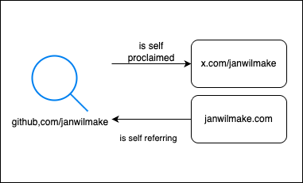

# Building an AI-powered person entity resolution API with Parallel

TL;DR: We built a person entity resolution API that maps any identifier—name, email, username, or profile URL—to verified social profiles across Twitter, LinkedIn, GitHub, and more. One Task API call handles the entire resolution pipeline.

Tags: [Cookbook](/blog?tag=cookbook)

Reading time: 5 min

[Github](https://github.com/parallel-web/parallel-cookbook/tree/main/typescript-recipes/parallel-entity-resolution) [Try the App](https://entity-resolution-demo.parallel.ai)

---

The average professional maintains 7+ social media accounts. Sales reps, recruiters, and researchers face the same challenge: given a name and an email, find the complete digital footprint.

Manual searches don't scale. Name matching breaks down ("John Smith" returns millions). Cross-references are invisible to traditional search.

We built an API that solves this using Parallel's Task API.



## Key features

- **Any identifier input**: Name, email, username, or profile URL
- **Multi-platform search**: Twitter, LinkedIn, GitHub, Instagram, Facebook, TikTok
- **Chain following**: Automatically follows self-proclaimed links (Twitter bio → GitHub → LinkedIn)
- **Confidence indicators**: Distinguishes self-proclaimed vs externally discovered profiles
- **Conservative matching**: Only returns high-confidence matches

## Architecture

The entity resolution API implements a single-call pattern:

1. Parse input for identifiers (handles, emails, URLs, names, affiliations)
2. Search across platforms using multiple strategies
3. Follow transitive chains of self-references
4. Verify bidirectionally where possible
5. Return structured profiles with reasoning

This architecture leverages the Task API's built-in web research capabilities—no separate search, scrape, or ranking pipeline required.

## Technology stack

- [Parallel Task API](https://docs.parallel.ai/task-api/task-quickstart) for the complete resolution pipeline
- [Parallel OAuth Provider](https://docs.parallel.ai/integrations/oauth-provider) for API key management
- [Cloudflare Workers](https://workers.cloudflare.com/) for serverless deployment
- Pure HTML/JavaScript/CSS frontend

## Why this architecture

**Single Task API call vs research pipeline**

Traditional entity resolution requires building a pipeline: search each platform, scrape results, extract profiles, cross-reference, rank by confidence. The Task API collapses this into one call with structured output.

The `pro` processor handles the reasoning required to follow chains of self-references and verify matches—tasks that would otherwise require custom logic.

**Structured output for integration**

The API returns typed JSON that slots directly into CRM systems, enrichment pipelines, or downstream analysis:

### Example response

```json
{
  "profiles": [
    {
      "platform_slug": "twitter",
      "profile_url": "https://twitter.com/johndoe",
      "is_self_proclaimed": true,
      "is_self_referring": true,
      "match_reasoning": "Profile bio links to LinkedIn and GitHub profiles found in search",
      "profile_snippet": "CTO @TechCorp | Building AI infrastructure"
    },
    {
      "platform_slug": "github",
      "profile_url": "https://github.com/johndoe",
      "is_self_proclaimed": true,
      "is_self_referring": false,
      "match_reasoning": "Linked from Twitter profile, same name and company affiliation",
      "profile_snippet": "CTO at TechCorp. 50 repositories, 2.3k followers"
    }
  ]
}
```

**Conservative by design**

False positives in entity resolution are worse than false negatives. The API only returns high-confidence matches with explicit reasoning for each.

## Implementation

### Defining the Task API call

The resolution request uses a structured output schema to ensure consistent, typed responses:

### Task API request with JSON schema

```typescript
const client = new Parallel({ apiKey });

const result = await client.taskRun.create({
  input: `You are a person entity resolution system. Given information about a person, find and return their digital profiles across various platforms.

Input: "${body.input}"

Instructions:
1. Analyze the input for social media handles, usernames, email addresses, names, or other identifying information
2. Search for profiles across Twitter, LinkedIn, GitHub, Instagram, Facebook, TikTok
3. For each profile, determine is_self_proclaimed, is_self_referring, match_reasoning, and profile_snippet
4. Only return profiles you're confident belong to the same person`,
  processor: "pro",
  task_spec: {
    output_schema: { json_schema: output_json_schema, type: "json" },
  },
});
```

### The confidence framework

Two boolean fields capture match quality:

**`is_self_proclaimed`**: Whether this profile was discovered through the input's chain of references.

- `true` if directly mentioned in input, linked from an input profile, or part of a transitive chain
- `false` if discovered only through external search

**`is_self_referring`**: Whether this profile links back to other found profiles.

- Creates bidirectional verification
- Highest confidence signal when combined with `is_self_proclaimed`

### Async polling pattern

Entity resolution takes time—following chains, verifying cross-references, searching multiple platforms. The API uses async submission with polling:

### Submit and poll

```typescript
// Submit resolution request
const response = await fetch("/resolve", {
  method: "POST",
  headers: { "Content-Type": "application/json", "x-api-key": "YOUR_API_KEY" },
  body: JSON.stringify({ input: "john.doe@techcorp.com, @johndoe on Twitter" }),
});

const { trun_id } = await response.json();

// Poll for results
const result = await fetch(`/resolve/${trun_id}`, {
  headers: { "x-api-key": "YOUR_API_KEY" },
});
```

### OAuth integration

The demo uses Parallel's OAuth Provider for API key management, allowing users to authenticate with their Parallel account:

### OAuth flow with PKCE

```typescript
const authUrl = new URL("https://platform.parallel.ai/getKeys/authorize");
authUrl.searchParams.set("client_id", window.location.hostname);
authUrl.searchParams.set("redirect_uri", `${window.location.origin}/callback`);
authUrl.searchParams.set("response_type", "code");
authUrl.searchParams.set("scope", "key:read");
authUrl.searchParams.set("code_challenge", codeChallenge);
authUrl.searchParams.set("code_challenge_method", "S256");
```

## Use cases

**Sales intelligence**: Complete digital footprint beyond LinkedIn. 10x more context per lead.

**Technical recruiting**: Evaluate actual code contributions on GitHub, communication style on Twitter, thought leadership across platforms.

**Customer success**: Connect product usage to social presence. Find advocates. Spot at-risk accounts through sentiment.

**Data quality**: Merge duplicate CRM records by linking profiles to verified external identities.

## Getting started

### Clone and deploy

```bash
git clone https://github.com/parallel-web/parallel-cookbook
cd typescript-recipes/parallel-entity-resolution
npm install
npm run dev
```

## Resources

- [Live Demo](https://entity-resolution-demo.parallel.ai)
- [Source Code](https://github.com/parallel-web/parallel-cookbook/tree/main/typescript-recipes/parallel-entity-resolution)
- [Task API Documentation](https://docs.parallel.ai/task-api/task-quickstart)
- [OAuth Provider Documentation](https://docs.parallel.ai/integrations/oauth-provider)

By Parallel

January 19, 2026
