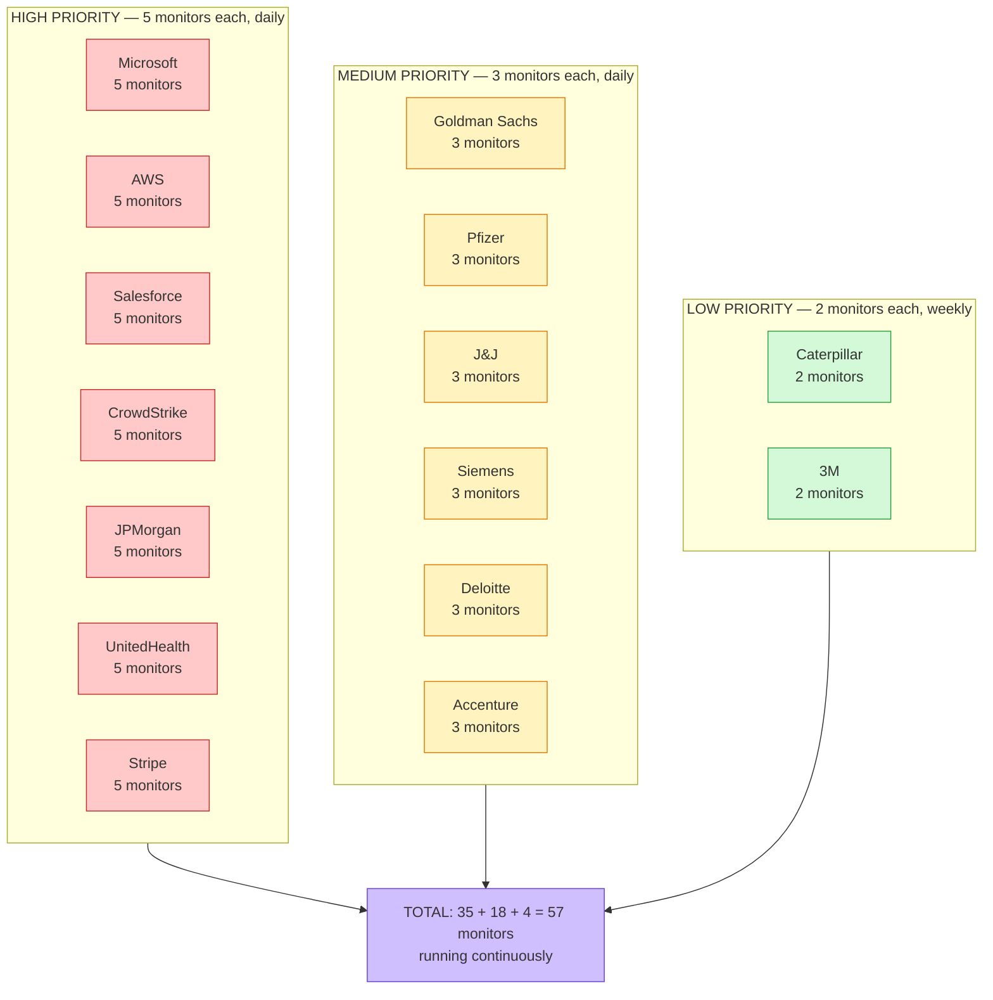
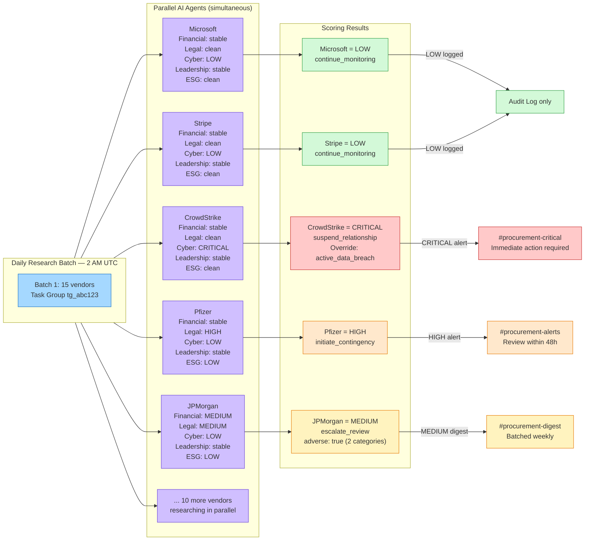
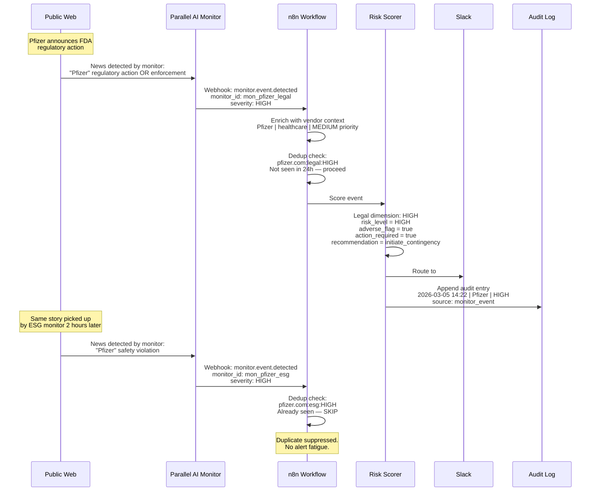
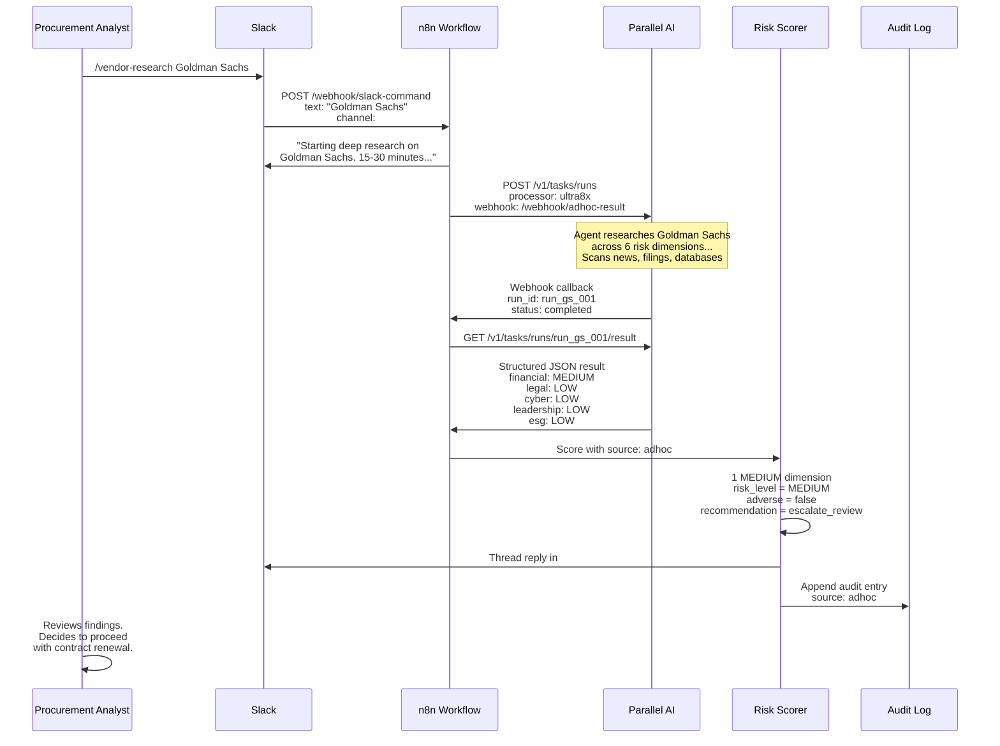

# Parallel Procurement — Live System Mockup

A snapshot of the system running for 15 vendors. Dozens of AI agents working simultaneously across the web. Information flowing to your team in Slack.

## System in Action

```mermaid
flowchart LR
    subgraph VENDORS["YOUR VENDOR PORTFOLIO (15 vendors)"]
        direction TB

        subgraph TECH["Technology"]
            MS["Microsoft\nHIGH"]
            AWS["AWS\nHIGH"]
            SF["Salesforce\nHIGH"]
            CS["CrowdStrike\nHIGH"]
        end

        subgraph FIN["Financial Services"]
            JPM["JPMorgan Chase\nHIGH"]
            GS["Goldman Sachs\nMEDIUM"]
            STR["Stripe\nHIGH"]
        end

        subgraph HEALTH["Healthcare"]
            UHG["UnitedHealth\nHIGH"]
            PFE["Pfizer\nMEDIUM"]
            JNJ["Johnson & Johnson\nMEDIUM"]
        end

        subgraph MFG["Manufacturing"]
            SIE["Siemens\nMEDIUM"]
            CAT["Caterpillar\nLOW"]
            MMM["3M\nLOW"]
        end

        subgraph SVC["Professional Services"]
            DEL["Deloitte\nMEDIUM"]
            ACN["Accenture\nMEDIUM"]
        end
    end

    subgraph PARALLEL["PARALLEL AI — AGENTS ACROSS THE WEB"]
        direction TB

        subgraph RESEARCH["Deep Research Agents (daily batch)"]
            direction LR
            R_MS["Researching Microsoft\n6 dimensions\nultra8x processor"]
            R_STR["Researching Stripe\n6 dimensions\nultra8x processor"]
            R_UHG["Researching UnitedHealth\n6 dimensions\nultra8x processor"]
            R_JPM["Researching JPMorgan\n6 dimensions\nultra8x processor"]
            R_CS["Researching CrowdStrike\n6 dimensions\nultra8x processor"]
        end

        subgraph DIMS["What each agent investigates"]
            D1["Financial Health\nearnings, credit, debt"]
            D2["Legal & Regulatory\nlawsuits, SEC, sanctions"]
            D3["Cybersecurity\nbreaches, CVEs, SOC2"]
            D4["Leadership\nexec changes, M&A"]
            D5["ESG & Reputation\nrecalls, labor, fines"]
            D6["Adverse Events\nbreaking news"]
        end

        subgraph MONITORS["47 Persistent Monitors (always watching)"]
            direction TB
            M1["CrowdStrike — cyber\ndata breach OR ransomware\nDAILY"]
            M2["CrowdStrike — legal\nlawsuit OR SEC investigation\nDAILY"]
            M3["Microsoft — cyber\ndata breach OR ransomware\nDAILY"]
            M4["Microsoft — leadership\nCEO departure OR acquisition\nDAILY"]
            M5["JPMorgan — financial\nbankruptcy OR credit downgrade\nDAILY"]
            M6["JPMorgan — legal\nlawsuit OR SEC investigation\nDAILY"]
            M7["Stripe — cyber\ndata breach OR ransomware\nDAILY"]
            M8["Stripe — financial\nbankruptcy OR credit downgrade\nDAILY"]
            M9["Pfizer — legal\nFDA action OR enforcement\nDAILY"]
            M10["Goldman Sachs — legal\nlawsuit OR SEC investigation\nDAILY"]
            M11["Caterpillar — legal\nlawsuit OR regulatory action\nWEEKLY"]
            M12["3M — financial\nbankruptcy OR credit downgrade\nWEEKLY"]
            M13["Siemens — cyber\ndata breach OR ransomware\nDAILY"]
            M14["Deloitte — financial\nfinancial distress OR layoffs\nDAILY"]
        end

        subgraph ADHOC["Ad-Hoc Agent (on-demand)"]
            SLASH["/vendor-research Goldman Sachs"]
            AGENT["Agent researching\nGoldman Sachs..."]
            REPLY["Thread reply:\nGoldman Sachs assessed at\nMEDIUM risk. No adverse."]
        end
    end

    subgraph SCORING["RISK SCORING ENGINE"]
        direction TB
        RULES["Deterministic Rules\nany CRITICAL dim = CRITICAL\nany HIGH dim = HIGH\n3+ MEDIUM = MEDIUM adverse\nelse = LOW"]
        OVERRIDES["Overrides\ncyber CRITICAL = force CRITICAL\nlegal CRITICAL = force min HIGH\nrisk_tier_override = floor"]
    end

    subgraph DELIVERY["SLACK — YOUR TEAM SEES THIS"]
        direction TB
        CH1["#procurement-critical\nCRITICAL: CrowdStrike\nActive vulnerability disclosure\naffecting endpoint platform.\nReview within 24 hours."]
        CH2["#procurement-alerts\nHIGH: Pfizer\nFDA regulatory action on\nmanufacturing compliance.\nReview within 48 hours."]
        CH3["#procurement-digest\nWeekly Digest: 15 vendors\n1 CRITICAL, 1 HIGH\n3 MEDIUM, 10 LOW\n1 adverse finding"]
        CH4["#vendor-risk-ops\nHealth Check: 47 monitors\nactive. 0 failed.\n0 orphaned. Webhook OK."]
    end

    subgraph AUDIT["AUDIT LOG (Google Sheets)"]
        direction TB
        A1["2026-03-05 02:14 | CrowdStrike | CRITICAL | true\nActive vulnerability disclosure | deep_research"]
        A2["2026-03-05 02:14 | Pfizer | HIGH | true\nFDA regulatory action | deep_research"]
        A3["2026-03-05 02:15 | Microsoft | LOW | false\nNo adverse conditions | deep_research"]
        A4["2026-03-05 09:41 | Goldman Sachs | MEDIUM | false\nModerate financial findings | adhoc"]
        A5["2026-03-05 14:22 | JPMorgan | MEDIUM | true\nSEC inquiry reported | monitor_event"]
    end

    %% === VENDOR TO RESEARCH CONNECTIONS ===
    MS --> R_MS
    STR --> R_STR
    UHG --> R_UHG
    JPM --> R_JPM
    CS --> R_CS

    %% === VENDOR TO MONITOR CONNECTIONS ===
    CS -.-> M1
    CS -.-> M2
    MS -.-> M3
    MS -.-> M4
    JPM -.-> M5
    JPM -.-> M6
    STR -.-> M7
    STR -.-> M8
    PFE -.-> M9
    GS -.-> M10
    CAT -.-> M11
    MMM -.-> M12
    SIE -.-> M13
    DEL -.-> M14

    %% === RESEARCH DIMENSION FAN-OUT ===
    R_MS --> D1
    R_MS --> D2
    R_MS --> D3
    R_MS --> D4
    R_MS --> D5
    R_MS --> D6

    %% === RESEARCH TO SCORING ===
    R_MS ==> RULES
    R_STR ==> RULES
    R_UHG ==> RULES
    R_JPM ==> RULES
    R_CS ==> RULES

    %% === MONITOR EVENTS TO SCORING ===
    M1 -- "EVENT DETECTED" --> RULES
    M6 -- "EVENT DETECTED" --> RULES
    M9 -- "EVENT DETECTED" --> RULES

    %% === AD-HOC FLOW ===
    SLASH --> AGENT
    AGENT --> RULES
    RULES --> REPLY

    %% === SCORING TO DELIVERY ===
    RULES --> OVERRIDES
    OVERRIDES -- "CRITICAL" --> CH1
    OVERRIDES -- "HIGH" --> CH2
    OVERRIDES -- "MEDIUM" --> CH3
    OVERRIDES -- "ops" --> CH4

    %% === SCORING TO AUDIT ===
    OVERRIDES --> A1
    OVERRIDES --> A2
    OVERRIDES --> A3
    OVERRIDES --> A4
    OVERRIDES --> A5

    %% === STYLES ===
    classDef tech fill:#dbeafe,stroke:#1971c2,color:#1e1e1e
    classDef fin fill:#d3f9d8,stroke:#2f9e44,color:#1e1e1e
    classDef health fill:#fce4ec,stroke:#c92a2a,color:#1e1e1e
    classDef mfg fill:#f1f3f5,stroke:#495057,color:#1e1e1e
    classDef svc fill:#e8dff5,stroke:#6741d9,color:#1e1e1e
    classDef agent fill:#d0bfff,stroke:#6741d9,color:#1e1e1e
    classDef monitor fill:#e8dff5,stroke:#6741d9,color:#1e1e1e
    classDef scoring fill:#ffe3e3,stroke:#c92a2a,color:#1e1e1e
    classDef slack fill:#fff3bf,stroke:#e67700,color:#1e1e1e
    classDef critical fill:#ffc9c9,stroke:#c92a2a,color:#1e1e1e
    classDef audit fill:#d3f9d8,stroke:#2f9e44,color:#1e1e1e

    class MS,AWS,SF,CS tech
    class JPM,GS,STR fin
    class UHG,PFE,JNJ health
    class SIE,CAT,MMM mfg
    class DEL,ACN svc
    class R_MS,R_STR,R_UHG,R_JPM,R_CS,AGENT agent
    class D1,D2,D3,D4,D5,D6 agent
    class M1,M2,M3,M4,M5,M6,M7,M8,M9,M10,M11,M12,M13,M14 monitor
    class RULES,OVERRIDES scoring
    class CH1 critical
    class CH2,CH3,SLASH,REPLY slack
    class CH4 tech
    class A1,A2,A3,A4,A5 audit
```

## Monitor Portfolio Breakdown

## Research Batch Detail

## Event Detection Flow

## Ad-Hoc Research Flow

