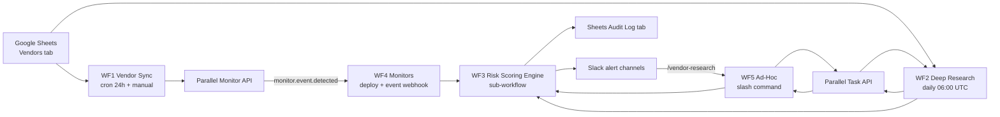
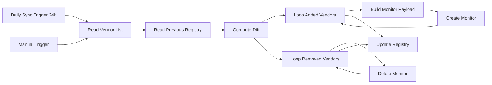
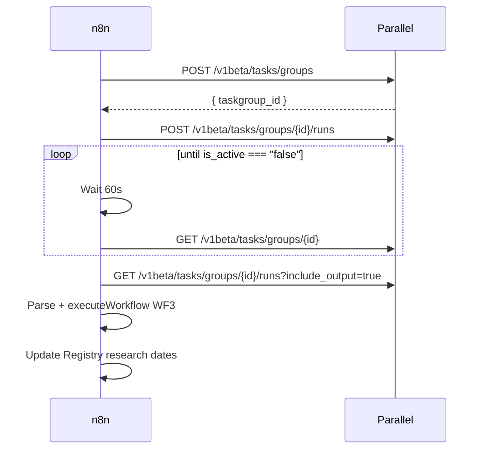
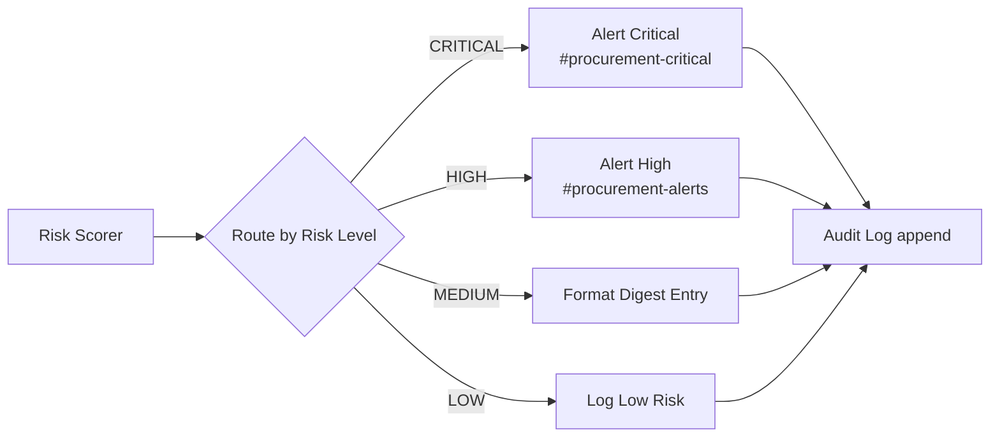
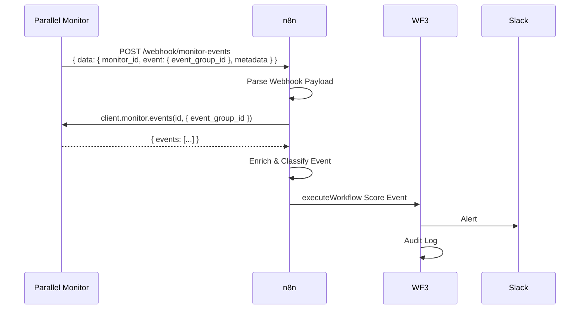
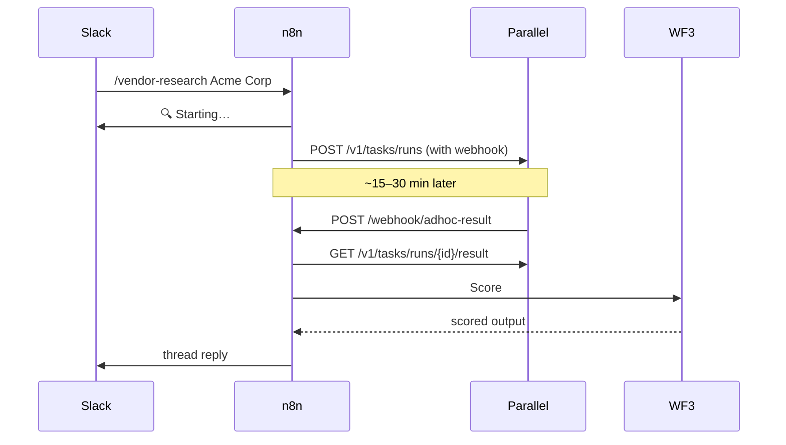

# n8n Workflow Orchestration

A reference for the procurement vendor risk system — the five n8n workflows, the shared scoring engine they all converge on, and the precise cadences, thresholds, overrides, and webhooks that drive the runtime.

---

## 1. How to read this doc

This document covers the **n8n side** of the procurement risk system: the five workflow generators in [n8n-procurement/src/workflows/generators/](../src/workflows/generators/), the helper API in [n8n-procurement/src/workflows/generator-utils.ts](../src/workflows/generator-utils.ts), and the JSON workflow files they emit into [n8n-procurement/n8n-workflows/](../n8n-workflows/). It is **not** a doc for the SaaS dashboard rebuild that lives under [n8n-procurement/dashboard/](../dashboard/) — that is a separate Next.js + Supabase reimplementation of the same business logic.

The most surprising thing about this codebase, and the one fact you need before reading anything else, is this: the TypeScript service classes in [n8n-procurement/src/services/](../src/services/) — `RiskScorer`, `BatchPlanner`, `MonitorPortfolioManager`, `EventDedupCache`, `MonitorHealthChecker`, etc. — are a **parallel, testable reference implementation**. The n8n workflows do **not** import them. Each Code-node in n8n re-implements the relevant logic inline as a string of JavaScript. That means runtime behavior is defined by the `*_CODE` constants inside the generator files, not by the TS classes. The TS classes exist for unit tests and for porting to other runtimes (the dashboard reuses them); the n8n imports are intentionally inlined so a single workflow JSON is fully self-contained.

Throughout the doc:

- "WF1–WF5" refer to the five split-mode workflows: vendor sync, deep research, risk scoring, monitors, ad-hoc.
- "Combined workflow" refers to [workflow-combined.ts](../src/workflows/generators/workflow-combined.ts), which inlines all five into one importable workflow.
- "Generator" refers to the `.ts` file that produces an importable n8n JSON via the `generate-all` CLI.
- "SDK" refers to the official [`parallel-web`](https://www.npmjs.com/package/parallel-web) TypeScript library — every Parallel API call in this codebase (both the TS services and the n8n Code nodes) goes through it. Self-hosted n8n needs `NODE_FUNCTION_ALLOW_EXTERNAL=parallel-web` to allow the Code node sandbox to `require()` it; see [SETUP.md](../SETUP.md).
- Anywhere docs disagree, the generator wins. Section 11 enumerates every conflict.

If you only have time for one section, read §6 (WF3 — the shared scoring engine). If you have two, add §10 (day in the life). Everything else is reference material around those two.

## 2. System at a glance

The system has five n8n workflows. WF1 keeps the Parallel monitor fleet in sync with a Google Sheet of vendors. WF2 runs daily deep research on every vendor that's due. WF4 receives Parallel monitor events as webhooks. WF5 lets a Slack analyst run ad-hoc research on a single vendor via slash command. All three of those — research output, monitor events, and ad-hoc results — fan into **WF3, the shared risk scoring engine**, which assigns a single risk level, decides whether to ping Slack and on which channel, and appends one row to the audit log.



One-line role per workflow:

| Workflow | Role |
| -------- | ---- |
| **WF1 — Vendor Sync** | Diff the Vendors sheet against the previous Registry; create/delete Parallel monitors for added/removed vendors. Pure fleet upkeep — no Slack. |
| **WF2 — Deep Research** | Once a day, build a Parallel **Task Group** for every vendor that's due, poll until done, fan all results into WF3, then advance `next_research_date`. |
| **WF3 — Risk Scoring** | Sub-workflow only. Take a six-dimension research output OR a monitor event, score it (LOW/MEDIUM/HIGH/CRITICAL), apply two override rules, post a Slack alert, and append an audit row. The shared sink for WF2/WF4/WF5. |
| **WF4 — Monitors** | Two disconnected subgraphs in one workflow. Subgraph A: deploy monitors on demand. Subgraph B: receive `monitor.event.detected` webhooks, enrich, hand to WF3. |
| **WF5 — Ad-Hoc** | A `/vendor-research <name>` Slack slash command kicks off a single Parallel run, then a webhook callback scores the result and posts it back as a thread reply. |

The four sinks WF3 writes to are: `#procurement-critical`, `#procurement-alerts`, the digest formatter (no Slack), and the Audit Log tab (Google Sheets append). The combined workflow swaps the hardcoded channel names for `$vars.SLACK_ALERT_TARGET`.

## 3. Shared substrate

Three shared resources tie the workflows together: a Google Sheet of state, the Parallel API, and a small set of n8n environment variables.

**Google Sheets schema.** One spreadsheet (id read from `$vars.GOOGLE_SHEET_ID`) holds four tabs:

| Tab | Written by | Columns |
| --- | --- | --- |
| `Vendors` | Humans | `vendor_name`, `vendor_domain`, `vendor_category`, `monitoring_priority` (`high` / `medium` / `low`), `active` |
| `Registry` | WF1 | All `Vendors` columns + `next_research_date`, monitor IDs |
| `Audit Log` | WF3 | `timestamp`, `vendor_name`, `risk_level`, `adverse_flag`, `categories`, `summary`, `run_id`, `source` |
| `Monitors` | WF1 / WF4 | One row per Parallel monitor with vendor + `monitor_id` |

Sheets reads/writes go through the helper [`googleSheetsNode`](../src/workflows/generator-utils.ts), which always uses `documentId = $vars.GOOGLE_SHEET_ID` and either `read` or `appendOrUpdate` operations. There is no manual cell addressing.

**Parallel API surface (V1 + SDK).** Every Parallel call is now made through the official [`parallel-web`](https://www.npmjs.com/package/parallel-web) TypeScript SDK from inside a Code node (the [`parallelSdkCodeNode`](../src/workflows/generator-utils.ts) helper wraps the boilerplate). There are no `httpRequestNode` calls to `api.parallel.ai` anywhere in the generators — every URL is now resolved by the SDK against the V1 endpoints. The SDK methods + their underlying V1 endpoints are:

| SDK method | V1 endpoint | Used by |
| --- | --- | --- |
| `client.monitor.create(...)` | `POST /v1/monitors` | WF1 (Sync: Create Monitor), WF4 (Monitor: Create Monitor), combined |
| `client.monitor.cancel(id)` | `POST /v1/monitors/{id}/cancel` | WF1 (Sync: Cancel Monitor), combined; replaces the v1alpha `DELETE` |
| `client.monitor.trigger(id)` | `POST /v1/monitors/{id}/trigger` | TS `MonitorHealthChecker` (immediate re-run after recreating a failed monitor) |
| `client.monitor.list(query)` | `GET /v1/monitors` | TS `MonitorHealthChecker` (paginated via `next_cursor`) |
| `client.monitor.events(id, { event_group_id })` | `GET /v1/monitors/{id}/events` | WF4 (Monitor: Fetch Event Details), combined |
| `client.taskRun.create({ webhook })` | `POST /v1/tasks/runs` | WF5 (AdHoc: Start Research Task), combined |
| `client.taskRun.result(run_id)` | `GET /v1/tasks/runs/{id}/result` | WF5 (AdHoc: Fetch Result), combined |
| `client.taskGroup.create({})` | `POST /v1beta/tasks/groups` | WF2 (Research: Run Task Group), combined |
| `client.taskGroup.addRuns(id, { inputs, default_task_spec })` | `POST /v1beta/tasks/groups/{id}/runs` | WF2, combined (batched 50 vendors at a time) |
| `client.taskGroup.retrieve(id)` | `GET /v1beta/tasks/groups/{id}` | WF2, combined (status polling) |
| `client.taskGroup.getRuns(id, { include_output: true })` | `GET /v1beta/tasks/groups/{id}/runs?include_output=true` | WF2, combined (drains the stream into a JSON array) |

The TS reference services in [`src/services/parallel-monitor-client.ts`](../src/services/parallel-monitor-client.ts) and [`src/services/parallel-task-client.ts`](../src/services/parallel-task-client.ts) wrap the same SDK calls and translate `Parallel.APIError` into the procurement-specific `ParallelApiError` so the rest of the codebase keeps its existing catch shapes.

**Why SDK, not HTTP nodes?** The V1 contract is a discriminated union (`type: "event_stream" | "snapshot"`) with nested `settings` + `advanced_settings`, processor-tier selection, cursor pagination on `/events`, and typed `output: { type, content, basis }` shapes. Hand-rolling URL templates against that surface gets brittle fast; the SDK gives us typed payloads, auto-retry on 408/409/429/5xx, and free upgrades when the API evolves. The trade-off is that self-hosted n8n needs `NODE_FUNCTION_ALLOW_EXTERNAL=parallel-web` for the Code node sandbox to import the module (see [SETUP.md](../SETUP.md)).

### 3.5 Basis plumbing (Task API `output.basis` → audit log + Slack)

V1 Task and Monitor API responses both ship an `output.basis` array — one `FieldBasis` entry per output field with `reasoning`, `confidence`, and a list of citation URLs. The procurement scorer uses this to turn "the AI flagged this" into "the SEC filing on 2026-03-05 was the trigger" without any extra Parallel round-trips.

The pipeline is:

1. **WF2 / WF5** keep `output.basis` alongside `output.content` when collecting results from `taskGroup.getRuns()` / `taskRun.result()`.
2. **WF4** reads `entry.output.basis` from the V1 event_stream event returned by `client.monitor.events({ event_group_id })`.
3. The shared **WF3 `SCORING_CODE`** groups basis entries by dimension (matching `field === d` or `field.startsWith(d + '.')` for the 5 risk dimensions), sorts each group by `confidence` (`high` > `medium` > `low`), and picks the top citation per triggered dimension. The result lives on `assessment.top_citations` (capped at 3 total) and the top entry's url/title/confidence are flattened onto the audit-row columns `top_citation_url` / `top_citation_title` / `confidence`.
4. **Slack alerts** (CRITICAL, HIGH, monitor, ad-hoc thread reply) append a `Sources:` line with up to 3 markdown links pointing at those URLs.

The deterministic scoring cascade is unchanged — basis is a strictly additive audit/observability layer. Every step of the pipeline tolerates a missing or empty basis (LOW assessments and text-output monitors emit none).

**Env vars and credentials.** The workflows read three n8n variables (a fourth is optional in the combined form):

| `$vars.*` | Used by | Purpose |
| --- | --- | --- |
| `PARALLEL_API_KEY` | every HTTP node | `x-api-key` header for `api.parallel.ai` |
| `GOOGLE_SHEET_ID` | every Sheets node | the Sheet that holds Vendors / Registry / Audit Log / Monitors |
| `N8N_WEBHOOK_BASE_URL` | WF5, combined | base URL the Parallel callback webhooks resolve against |
| `SLACK_ALERT_TARGET` | combined only | overrides the hardcoded `#procurement-critical` / `#procurement-alerts` channels |

WF2, WF4, and WF5 in split mode use n8n `executeWorkflow` nodes to call WF3. Those nodes are built with `workflowId: ""` (see [`executeWorkflowNode`](../src/workflows/generator-utils.ts)). After importing the JSON you have to open each one in the n8n UI and pick the WF3 workflow, otherwise scoring just no-ops. The combined workflow eliminates this step by inlining WF3 instead.

## 4. WF1 — Vendor Sync

[`workflow1-vendor-sync.ts`](../src/workflows/generators/workflow1-vendor-sync.ts) keeps the deployed Parallel monitor fleet in sync with the Vendors sheet. It runs every 24 hours from a `Daily Sync Trigger` (the helper builds `scheduleNode("Daily Sync Trigger", 0, ...)` which becomes a 24-hour interval rule firing at hour `0`) and can also be kicked manually.



The diff is keyed by `vendor_domain`. From the generator:

```javascript
const incoming = $('Read Vendor List').all().map(i => i.json);
const previous = $('Read Previous Registry').all().map(i => i.json);

const incomingMap = new Map(incoming.map(v => [v.vendor_domain, v]));
const previousMap = new Map(previous.map(v => [v.vendor_domain, v]));

const added = incoming.filter(v => !previousMap.has(v.vendor_domain));
const removed = previous.filter(v => !incomingMap.has(v.vendor_domain));
const modified = incoming.filter(v => {
  const prev = previousMap.get(v.vendor_domain);
  return prev && (prev.monitoring_priority !== v.monitoring_priority || prev.vendor_category !== v.vendor_category);
});
```

`added` and `removed` flow into two independent `splitInBatches` loops (batch size 1) and then to `Create Monitor` / `Delete Monitor`. The monitor payload is generated per added vendor, with the cadence and the dimension set chosen by `monitoring_priority`:

```javascript
const cadence = vendor.monitoring_priority === "low" ? "weekly" : "daily";
const dims = vendor.monitoring_priority === "high" ? templates
  : vendor.monitoring_priority === "medium" ? templates.slice(0, 3)
  : [templates[0], templates[2]];
```

So a `high` vendor gets all five dimensions on a daily cadence (legal, cyber, financial, leadership, esg → 5 monitors). A `medium` vendor gets the first three (legal, cyber, financial). A `low` vendor gets two — `templates[0]` (legal) and `templates[2]` (financial) — on a weekly cadence. PRD/architecture call this the "legal + financial" pair; the SETUP table at one point claims "legal + cyber". The generator ships legal + financial; see §11.

There is **one real gap** worth flagging here: `modified` vendors are computed by the diff but no connection in `buildConnections([...])` consumes them. The PRD says "if `monitoring_priority` changes, replace the monitor set," but the generator wires only `added` and `removed` to downstream nodes. The combined workflow has the same shape. Treat priority change as a manual operation today: delete the Vendors row, run sync, re-add the row with the new priority, run sync.

WF1 is the only workflow that **does not** post to Slack. It's pure fleet upkeep against the Parallel monitor API plus an `Update Registry` write at the end. That sheet write is what later workflows read from to know who to research.

## 5. WF2 — Deep Research

[`workflow2-deep-research.ts`](../src/workflows/generators/workflow2-deep-research.ts) is the daily deep-research batch. The schedule trigger is built as `scheduleNode("Daily 6AM Trigger", 6, pos(0, 0))` — a 24-hour interval rule that fires at hour 6. The PRD claims 02:00 UTC; the generator ships 06:00 UTC.

The full chain is: read Registry → filter due vendors → create a Parallel Task Group → build a runs payload (one run per due vendor, each with the six-dimension JSON output schema attached) → post all runs to the group → wait 60 s → poll group status → if `status.is_active === "false"` get results, else loop back to wait → parse completed results → execute WF3 to score & route → update `next_research_date` for the vendors that ran.



**Filter Due Vendors** is a Code node that drops inactive vendors and includes anyone with no `next_research_date` or a date that's already past:

```javascript
const today = new Date().toISOString().slice(0, 10);
const vendors = $input.all().map(i => i.json);
const due = vendors.filter(v => {
  if (v.active === false || v.active === "false") return false;
  if (!v.next_research_date) return true;
  return v.next_research_date.slice(0, 10) <= today;
});
return due.map(v => ({ json: v }));
```

**Build Task Runs** assembles one big POST body with all due vendors and the per-group default output schema:

```javascript
const inputs = vendors.map(v => ({
  input: "Conduct a vendor risk assessment of " + v.vendor_name + " (" + v.vendor_domain + ").",
  processor: "ultra8x"
}));
return [{ json: { runsPayload: JSON.stringify({ inputs, default_task_spec: { output_schema: outputSchema } }) } }];
```

`outputSchema` is the six-dimension JSON contract that drives every downstream scoring decision: `vendor_name`, `overall_risk_level` (enum LOW/MEDIUM/HIGH/CRITICAL), the five dimension objects (`financial_health`, `legal_regulatory`, `cybersecurity`, `leadership_governance`, `esg_reputation`, each with `status`, `findings`, `severity`), `adverse_events` array, and a `recommendation` string. WF5 declares the same shape inline; WF3 reads it.

**Polling** is a tight loop: `Wait 60s` → `Poll Group Status` (GET the group) → an `if` node that checks `={{ $json.status.is_active }}` against the literal string `"false"`. True branch → `Get Results`. False branch → back to `Wait 60s`. There is no explicit timeout in the workflow; n8n's own execution timeout is the upper bound. The TS reference (`ResearchOrchestrator`) caps polling at `pollTimeoutMs = 3_600_000` (one hour).

**Parse Results** filters to `status === "completed"`, joins each run back to its source vendor by index, then hands the array to **WF3** through an `executeWorkflow` node. After WF3 returns, **Update Research Dates** writes back to the Registry — at runtime your Code node owns choosing the next date (PRD: HIGH/CRITICAL → 7 d, MEDIUM → 14 d, LOW → 30 d).

**Failure semantics.** Failed runs aren't retried by this workflow. The `Parse Results` filter drops anything that isn't `"completed"`, so failed vendors keep their existing `next_research_date` and roll into the next cycle. There is no dead-letter queue; you'd notice via missing rows in the Audit Log.

**The batching gap.** The PRD, the README, and the architecture diagram all say "max 50 vendors per Task Group". The TS `BatchPlanner` defaults to `batchSize = 50`. The WF2 generator does **not** chunk: it submits all due vendors in one `addRunsToGroup` call. For a fleet of <50 this is fine; if you sync 200 vendors and they're all due the same day, you'll send 200 runs in one group. The TS `BatchPlanner` is unit-tested and ready to port; nothing in n8n calls it.

## 6. WF3 — Risk Scoring Engine

WF3 is the orchestration crux. WF2, WF4, and WF5 all funnel into it. It is built from [`workflow3-risk-scoring.ts`](../src/workflows/generators/workflow3-risk-scoring.ts) and triggered **only** by `executeWorkflowTrigger` — there is no schedule, no webhook. Whoever calls it is responsible for shaping the input as either a research output or a monitor event.

The scorer is one Code node, ~50 lines of JavaScript. Its job is to turn five dimension severities + two `status` strings into one `risk_level`, one `adverse_flag`, one `recommendation`, an `action_required` boolean, a list of `triggered_overrides`, and a one-line `summary`. From the generator:

```javascript
const input = $input.first().json;
const output = input.research_output || input;

// Step 1: Severity aggregation
const dims = ['financial_health','legal_regulatory','cybersecurity','leadership_governance','esg_reputation'];
const counts = { CRITICAL: 0, HIGH: 0, MEDIUM: 0, LOW: 0 };
const categories = [];
const mediumCats = [];

for (const dim of dims) {
  const sev = (output[dim]?.severity || 'LOW').toUpperCase();
  counts[sev] = (counts[sev] || 0) + 1;
  if (sev === 'CRITICAL' || sev === 'HIGH') categories.push(dim);
  if (sev === 'MEDIUM') mediumCats.push(dim);
}

// Step 2: Risk level assignment
let risk_level, adverse_flag;
if (counts.CRITICAL > 0) { risk_level = 'CRITICAL'; adverse_flag = true; }
else if (counts.HIGH >= 1) { risk_level = 'HIGH'; adverse_flag = true; }
else if (counts.MEDIUM >= 3) { risk_level = 'MEDIUM'; adverse_flag = new Set(mediumCats).size >= 2; }
else if (counts.MEDIUM >= 1) { risk_level = 'MEDIUM'; adverse_flag = false; }
else { risk_level = 'LOW'; adverse_flag = false; }

// Step 3: Overrides
const overrides = [];
if ((output.cybersecurity?.status || '').toUpperCase() === 'CRITICAL') {
  risk_level = 'CRITICAL'; adverse_flag = true; overrides.push('active_data_breach');
}
if ((output.legal_regulatory?.status || '').toUpperCase() === 'CRITICAL') {
  if (['LOW','MEDIUM'].includes(risk_level)) risk_level = 'HIGH';
  adverse_flag = true; overrides.push('active_government_litigation');
}
```

There are four phases:

**Phase 1 — Severity aggregation.** Iterate the five dimensions, default missing severities to `'LOW'`, count CRITICAL/HIGH/MEDIUM/LOW occurrences, track which dimensions hit HIGH+ (`categories`) and which hit MEDIUM (`mediumCats`).

**Phase 2 — Risk level assignment.** A short rule cascade. ≥1 CRITICAL → CRITICAL with `adverse_flag = true`. Else ≥1 HIGH → HIGH with `adverse_flag = true`. Else ≥3 MEDIUMs → MEDIUM, with `adverse_flag` true only if those mediums spread across ≥2 distinct dimensions. Else 1–2 MEDIUMs → MEDIUM not adverse. Else LOW. Note the SETUP table once said "HIGH = 2+ HIGH"; the generator says ≥1, and that's what ships.

**Phase 3 — Overrides.** Two unconditional override rules that look at the dimension *status* fields, not severity:

- If `cybersecurity.status === 'CRITICAL'` → force `risk_level = 'CRITICAL'`, `adverse_flag = true`, push `'active_data_breach'` into the overrides list.
- If `legal_regulatory.status === 'CRITICAL'` → floor at HIGH (only raises LOW/MEDIUM up to HIGH; doesn't lower CRITICAL), set `adverse_flag = true`, push `'active_government_litigation'`.

A `risk_tier_override` field on the vendor row could in principle act as a manual floor; the inline scorer doesn't honor it (the TS `RiskScorer` does), so today it's effectively documentation-only. The same caveat applies to per-dimension severity weighting: the TS `RiskScorer` exposes hooks for asymmetric weights (cyber and legal carry more than ESG by default), but the n8n inline version treats every dimension uniformly during the count. If you want either of those behaviors, the cheapest fix is to extend `SCORING_CODE` directly — it's a string literal, you can edit it in the generator file and rebuild. The TS class is the model to copy.

**Phase 4 — Derived fields.** `action_required = risk_level === 'HIGH' || risk_level === 'CRITICAL'`. The `recommendation` is a flat lookup: `LOW → continue_monitoring`, `MEDIUM → escalate_review`, `HIGH → initiate_contingency`, `CRITICAL → suspend_relationship`. The `summary` is one sentence: `"<vendor> assessed at <level> risk. <Adverse|No adverse> conditions detected."`.

The output object includes `source: input.source || 'deep_research'`. That field is the linchpin of multi-source routing in the combined workflow: WF2 and WF5 produce inputs without a `source`, so they default to `'deep_research'`; WF4 and the combined ad-hoc tagger explicitly set `source: 'monitor_event'` and `source: 'adhoc'`.

After the scorer, a 4-way **Switch on `risk_level`** fans out:



`Alert Critical` and `Alert High` are real-time Slack messages with emoji prefixes (`🔴 CRITICAL: <vendor> — <summary>`, `🟠 HIGH: <vendor> — <summary>`). MEDIUM goes through `Format Digest Entry`, which just stamps `digest_formatted: true` and doesn't post — the assumption is that an external batch process picks the digest rows up later from the Audit Log. LOW is a no-op (`return [$input.first()]`), kept only so that the audit fan-in stays uniform.

All four arms converge at `Audit Log`, a Sheets `appendOrUpdate` against the `Audit Log` tab. The row schema from the architecture diagram is `timestamp, vendor_name, risk_level, adverse_flag, categories, summary, run_id, source` — this is what makes the Audit Log a complete event stream that downstream tools (the dashboard snapshot endpoint, a BI dashboard, an analyst doing forensics) can replay without re-querying Parallel.

In the **combined workflow** (§9) the same `SCORING_CODE` is reused verbatim, but it sits at the bottom of one big DAG and is followed by a second switch (`Scoring: Route Back`) that branches on `source` to send results to the right "next step" per source.

## 7. WF4 — Continuous Monitoring

[`workflow4-monitors.ts`](../src/workflows/generators/workflow4-monitors.ts) is two disconnected subgraphs in a single workflow file.

**Sub-flow A — Deploy.** Triggered by `executeWorkflowTrigger` (so it's callable from another n8n workflow, including manually). It generates the per-priority query set for one vendor, splits into batches of one, calls `client.monitor.create({ type: "event_stream", frequency, processor, settings: { query, output_schema, advanced_settings: { location: "us" } }, ...})` from inside an SDK Code node, then appends the resulting monitor IDs to the `Monitors` sheet. The query generator uses the same dimension matrix as WF1 with two V1 additions: each monitor payload selects `processor: "base"` for HIGH-priority cyber + legal monitors (higher recall on hard queries) and `lite` everywhere else, and the `settings.output_schema` makes events come back as structured JSON rather than free text:

```javascript
output_schema: {
  type: "json",
  json_schema: { type: "object", properties: { event_summary: { type: "string" }, severity: { type: "string" }, adverse: { type: "boolean" }, event_type: { type: "string" } }, required: ["event_summary","severity","adverse","event_type"] }
}
```

**Sub-flow B — Events.** Triggered by an inbound POST to `/webhook/monitor-events`. The pipeline is: parse the webhook body, GET the event group from Parallel for full details, enrich/normalize, then call WF3.



The enrich step picks the first `type === 'event'` entry, prefers a structured `output` object, and falls back to wrapping a string output with `severity: 'LOW'` and `adverse: false`:

```javascript
let output = {};
if (eventEntry && eventEntry.output && typeof eventEntry.output === 'object') {
  output = eventEntry.output;
} else if (eventEntry && typeof eventEntry.output === 'string') {
  output = { event_summary: eventEntry.output, severity: 'LOW', adverse: false, event_type: 'unknown' };
}
return [{ json: { ...webhookData, ...output, source: 'monitor_event', event_date: eventEntry?.event_date, source_urls: eventEntry?.source_urls } }];
```

The `source: 'monitor_event'` tag flows through WF3 and ends up in the audit row's `source` column, which is how you tell "this CRITICAL came from a monitor" from "this CRITICAL came from a scheduled deep research".

**Two intentional gaps to flag.** First, neither WF4 subgraph implements **dedup** or **monitor health checking**. The TS reference has `EventDedupCache` (windowed dedup keyed by monitor + event group) and `MonitorHealthChecker` (looks for monitors that haven't fired in N days), and the architecture diagram lists both as in-scope. They live in [`src/services/event-dedup-cache.ts`](../src/services/event-dedup-cache.ts) and [`src/services/monitor-health-checker.ts`](../src/services/monitor-health-checker.ts) but no n8n workflow imports them. Second, **WF1 does not call WF4's deploy subgraph.** WF1 inlines its own monitor creation. So Sub-flow A is effectively a standalone deployment endpoint that you call yourself (e.g. from a one-off n8n workflow during onboarding, or from the dashboard). The combined workflow exposes it as `POST /webhook/deploy-monitors`, which is the easiest way to use it.

## 8. WF5 — Ad-Hoc Research

[`workflow5-adhoc.ts`](../src/workflows/generators/workflow5-adhoc.ts) is the human-driven escape hatch: any analyst in Slack types `/vendor-research Acme Corp` and gets a thread reply 15–30 minutes later with a full risk assessment for that vendor. Useful when something happens in the news that you don't want to wait for the next 06:00 UTC batch to investigate.

Two webhook entry points, run on different events, glued together by the Parallel run ID.

**Inbound subgraph** — handles the slash command:

1. `Slack Command` webhook at `/webhook/slack-command`.
2. `Parse Command` extracts `text` (vendor name) and `channel_id`, builds the prompt and the JSON output schema, and assembles the Parallel task body. Importantly it embeds the callback URL: `webhook: { url: $vars.N8N_WEBHOOK_BASE_URL + "/webhook/adhoc-result", events: ["task_run.status"] }`.
3. `Send Acknowledgment` posts back to the same channel: `🔍 Starting deep research on *Acme Corp*. This typically takes 15-30 minutes...`. This needs to be < 3 s end-to-end or Slack drops the slash command.
4. `Start Research Task` POSTs to `/v1/tasks/runs` (single run, not a Task Group) with `processor: "ultra8x"` and the webhook callback configured.

**Callback subgraph** — handles the result:

1. `Result Callback` webhook at `/webhook/adhoc-result`. Parallel POSTs here when the task changes status.
2. `Extract Run ID` pulls `run_id` and `status` from the payload (with `data.*` fallbacks).
3. `Get Research Result` GETs `/v1/tasks/runs/{run_id}/result` to fetch the actual content (the webhook itself doesn't include the result body).
4. `Score Result (WF3)` `executeWorkflow` calls into the shared scorer.
5. `Post Thread Reply` sends a Slack message back to the original `channel_id`.



Why this exists rather than reusing WF2: WF2 is gated on the daily Registry — a one-off research request for a vendor not in the Registry would have to wait until tomorrow, and even then would scoop up everyone else's due research. WF5 is single-vendor, single-shot, on-demand, no Registry dependency — and still benefits from the exact same scoring + audit logging, because the result fans into the same WF3.

## 9. The combined workflow

[`workflow-combined.ts`](../src/workflows/generators/workflow-combined.ts) is one importable workflow that inlines all five split-mode workflows. It exists for fast onboarding — one file to import, no `executeWorkflow` `workflowId` placeholders to wire up. The split workflows are still useful when you want each piece versioned, owned, or tested independently.

What changes versus the split form:

- **All `executeWorkflow` and `executeWorkflowTrigger` nodes are gone.** WF3's switch + audit-log chain becomes one shared region. The Research, Monitor Event, and Ad-Hoc paths all `connect(..., "Scoring: Risk Scorer")` directly — three explicit fan-in arrows in the connection list.
- **A second switch — `Scoring: Route Back` on `={{ $json.source }}`** — sits *after* the audit log. Output 0 (`deep_research`) → `Research: Update Research Dates`. Output 1 (`adhoc`) → `AdHoc: Post Thread Reply`. Output 2 (`monitor_event`) → terminal, no edge. This is what makes one shared scorer route results back to the correct branch's "next step" — without it you'd need three copies of WF3.
- **The research path uses per-vendor `POST /v1/tasks/runs` + a 90 s wait inside `splitInBatches`** instead of WF2's Task Group + poll loop. Different completion semantics, too: WF2's `Parse Results` filters `status === "completed"`; the combined `Research: Collect Results` filters `status === 'started'`. That's a known quirk — when the wait is short relative to the run duration, "started" is what you can actually see in the response. A real fix would either lengthen the wait or implement the Task Group pattern from WF2.
- **A snapshot webhook** at `GET /webhook/procurement-dashboard-snapshot` reads Registry + Audit Log + Monitors and returns a single JSON blob. It exists to back an external dashboard without giving it Sheets credentials.
- **Slack alert channels are configurable.** Instead of the hardcoded `#procurement-critical` / `#procurement-alerts`, both alert nodes use `={{ $vars.SLACK_ALERT_TARGET || '@sahithjagarlamudi' }}`.
- **All four standalone webhook paths get renamed:** the slash command handler is at `/webhook/slack-command` (same as WF5), but the monitor event endpoint is `/webhook/parallel-monitor-event` (vs WF4's `/webhook/monitor-events`), the ad-hoc callback is `/webhook/parallel-task-completion` (vs WF5's `/webhook/adhoc-result`), and there's a new `/webhook/deploy-monitors` for on-demand monitor deployment.

If you're starting fresh, import the combined workflow. If you're already running the split form, treat the combined workflow as a reference implementation of the routing — re-importing it would change your webhook paths.

## 10. End-to-end: day in the life of a vendor

You add `acme.com` to the `Vendors` tab at noon today, with `monitoring_priority = medium` and `active = true`. Here's everything that fires next.

**T+0 — Sheet add.** Just a row in Google Sheets. No automation runs yet.

**T+ ≤24 h — WF1 fires.** Daily Sync Trigger reads Vendors, reads Registry, computes diff. Acme appears in `added` because no row in Registry has `vendor_domain = acme.com`. The `splitInBatches` loop over `added` produces three V1 monitor payloads (medium → first three templates: legal, cyber, financial), all with `type: "event_stream"`, `frequency: "1d"`, `processor: "lite"`, and `settings.output_schema` set to the procurement-flat shape. Three `client.monitor.create(...)` calls from the SDK Code node. `Update Registry` writes the Acme row with the three monitor IDs. No Slack ping; this is silent fleet upkeep.

**T+ ≤24 h — WF2 fires (next 06:00 UTC).** `Read Registry` returns the new Acme row. `Filter Due Vendors` includes Acme because `next_research_date` is empty. A new Task Group is created, one run is added with `input: "Conduct a vendor risk assessment of Acme Corp (acme.com)."` plus the six-dimension output schema. The polling loop ticks every 60 s; let's say it completes in ~15 minutes. `Get Results` returns Acme's `research_output`. Suppose `cybersecurity.severity = "HIGH"` and the other four dimensions are `LOW`. WF3 fires: `counts.HIGH = 1` → `risk_level = "HIGH"`, `adverse_flag = true`, `recommendation = "initiate_contingency"`, `action_required = true`. The switch routes to `Alert High` → posts `🟠 HIGH: Acme Corp — Acme Corp assessed at HIGH risk. Adverse conditions detected.` to `#procurement-alerts`. Then `Audit Log` appends a row with `source = "deep_research"`. Finally, `Update Research Dates` advances Acme's `next_research_date` by 7 days (HIGH/CRITICAL cadence per PRD).

**T+1 d — Monitor event.** Parallel's daily monitor on Acme cyber detects a fresh news story and POSTs `monitor.event.detected` to `/webhook/monitor-events`. WF4's event subgraph parses, GETs the event group for full text, and the enrich step finds `output = { event_summary: "Acme Corp data breach affecting 2M users", severity: "CRITICAL", adverse: true, event_type: "data_breach" }`. WF3 runs: the `cybersecurity.status === "CRITICAL"` override fires, forcing `risk_level = "CRITICAL"`, `adverse_flag = true`, `triggered_overrides = ["active_data_breach"]`, `recommendation = "suspend_relationship"`. `Alert Critical` posts `🔴 CRITICAL: Acme Corp — Acme Corp assessed at CRITICAL risk. Adverse conditions detected.` to `#procurement-critical`. Audit row with `source = "monitor_event"`.

**Anytime — analyst slash command.** A security analyst sees the alert and wants more depth. They type `/vendor-research Acme Corp` in Slack. WF5's inbound webhook fires, posts `🔍 Starting deep research on *Acme Corp*…` back to the same channel within a second, then POSTs to `/v1/tasks/runs` with the callback configured. ~20 minutes later Parallel POSTs `/webhook/adhoc-result`. The callback subgraph fetches the result, scores it through WF3, and posts the scored summary as a thread reply on the original ack message. Audit row written with `source = "deep_research"` (or `"adhoc"` in the combined form).

```mermaid
gantt
  dateFormat HH:mm
  axisFormat %H:%M
  title Acme.com day-in-the-life
  section WF1
  Sync sees Acme :a1, 12:00, 30s
  Create 3 monitors :a2, after a1, 30s
  section WF2
  Daily research run (next morning) :b1, 06:00, 15m
  WF3 → #alerts (HIGH) :b2, after b1, 1m
  section WF4
  Monitor fires (data breach) :c1, 14:00, 30s
  WF3 → #critical (CRITICAL) :c2, after c1, 1m
  section WF5
  /vendor-research Acme :d1, 14:30, 30s
  WF3 → thread reply :d2, after d1, 25m
```



## 11. Cross-doc conflicts and what actually ships

The PRD, README, SETUP, and architecture diagram aren't always consistent. The generator is the source of truth for runtime; the table below resolves every disagreement against the generator.

| Topic | What docs say | What generator does | Ships |
| --- | --- | --- | --- |
| Monitor API version | Older docs reference `/v1alpha/monitors` | Every Parallel call goes through `client.monitor.*` / `client.taskRun.*` / `client.taskGroup.*` on the V1 endpoints | **V1 + parallel-web SDK** |
| WF2 schedule | PRD: 02:00 UTC | `scheduleNode("Daily 6AM Trigger", 6, ...)` | **06:00 UTC** |
| WF1 schedule | PRD "every few hours"; SETUP/README "6h" | `scheduleNode("Daily Sync Trigger", 0, ...)` (24-hour interval) | **24 h, hour 0** |
| HIGH threshold | PRD/README "≥1 HIGH"; SETUP table "2+ HIGH" | `else if (counts.HIGH >= 1) { risk_level = 'HIGH'; ... }` | **≥1 HIGH** |
| Batch size 50 | Stated everywhere | WF2's `Research: Run Task Group` chunks the `addRuns()` payload at `BATCH = 50` | **50 vendors per addRuns call** |
| Low-priority dimensions | PRD/architecture: legal + financial; SETUP table: legal + cyber | `[templates[0], templates[2]]` → templates[0] is legal, templates[2] is financial | **legal + financial** |
| Modified vendors in WF1 | PRD: priority change replaces monitor set | Generator computes `modified` but no connection consumes it | **No-op today** — manual delete + re-add required |
| Cyber CRITICAL override | PRD: forces CRITICAL + adverse | Same: `risk_level = 'CRITICAL'; adverse_flag = true; overrides.push('active_data_breach')` | **Matches PRD** |
| Legal CRITICAL override | PRD: floor at HIGH | Same, only raises LOW/MEDIUM up to HIGH; doesn't lower CRITICAL | **Matches PRD** |
| `risk_tier_override` | PRD: floor on risk_level | Inline `SCORING_CODE` and TS `RiskScorer` both honor it as a floor (never lowers a higher-classified result) | **Matches PRD in both n8n and TS** |
| Basis plumbing | V1: `output.basis` per field with citations + confidence | Scorer groups per dimension, lifts top citation onto `assessment.top_citations`; flattened onto audit columns + Slack `Sources:` block | **Plumbed end-to-end** |
| Dedup / monitor health | Architecture: in scope | Dedup lives in TS `EventDedupCache`; `MonitorHealthChecker` lists + cancels + recreates + triggers via SDK. n8n calls dedup inline in the event handler service; monitor health check is a TS reference, not an n8n node | **Dedup in TS+event handler; health check is TS-only** |
| V1 monitor status spelling | Alpha: `"canceled"` (single l); V1: `"cancelled"` (double l) | Every reference uses `"cancelled"` | **Matches V1** |
| V1 webhook event resolution | Alpha: `GET /event_groups/{id}`; V1: unified `/events?event_group_id=` | `client.monitor.events(monitorId, { event_group_id })` | **Matches V1** |

If you only need to remember four: V1 + SDK everywhere, WF2 is 06:00 UTC, HIGH is ≥1 HIGH (not 2+), and `output.basis` carries citations that end up on every audit row.

The pattern across these conflicts is consistent: the older docs describe the **intended** system (with batching, with priority-change handling, with dedup, with `risk_tier_override`), the TS service classes implement most of those intentions and have unit tests, and the n8n workflows ship a deliberately simpler subset that fits in a single Code-node string. When you find a discrepancy between this doc and any of the three legacy docs, prefer this doc + the generator code — they are kept in lock-step.

## 12. Operations: cadences, retries, dedup, env vars

A reference table for everything you need to run the system in production.

**Cron schedules.** All n8n schedule triggers in this repo use the helper `scheduleNode(name, hour, position)`, which builds a 24-hour interval rule. There are no sub-daily cron jobs.

| Workflow | Trigger | Effective cadence |
| --- | --- | --- |
| WF1 | `Daily Sync Trigger` (`hour 0`) + `Manual Trigger` | every 24 h at 00:00 UTC |
| WF2 | `Daily 6AM Trigger` (`hour 6`) + `Manual Trigger` | every 24 h at 06:00 UTC |
| WF3 | `executeWorkflowTrigger` only | on demand from WF2/WF4/WF5 |
| WF4 (deploy) | `executeWorkflowTrigger` | on demand |
| WF4 (events) | `webhook /webhook/monitor-events` | per Parallel monitor event |
| WF5 (inbound) | `webhook /webhook/slack-command` | per slash command |
| WF5 (callback) | `webhook /webhook/adhoc-result` | per Parallel task completion |

**HTTP retries.** None of the n8n HTTP nodes set `retryOnFail`. The TS Parallel clients ([`parallel-task-client.ts`](../src/services/parallel-task-client.ts), [`parallel-monitor-client.ts`](../src/services/parallel-monitor-client.ts)) implement 3-retry exponential backoff for 429/500/502/503 — but that's only relevant to the dashboard rebuild and to local scripts. In n8n you rely on n8n's per-node "Retry On Fail" toggle, which is **off by default**. If you care about 429 robustness, turn it on in the UI for the four `httpRequestNode` calls in WF1/WF2/WF4/WF5.

**Webhook paths.**

| Path | Workflow | Caller |
| --- | --- | --- |
| `/webhook/slack-command` | WF5 inbound, combined | Slack slash command |
| `/webhook/adhoc-result` | WF5 callback | Parallel `task_run.status` webhook |
| `/webhook/monitor-events` | WF4 events | Parallel `monitor.event.detected` webhook |
| `/webhook/parallel-task-completion` | combined ad-hoc callback | Parallel `task_run.status` webhook |
| `/webhook/parallel-monitor-event` | combined monitor events | Parallel `monitor.event.detected` webhook |
| `/webhook/deploy-monitors` | combined deploy | manual / dashboard |
| `/webhook/procurement-dashboard-snapshot` | combined snapshot | external dashboard (GET) |

**Environment variables and post-import wiring.** Set `$vars.PARALLEL_API_KEY`, `$vars.GOOGLE_SHEET_ID`, `$vars.N8N_WEBHOOK_BASE_URL` for split mode; add `$vars.SLACK_ALERT_TARGET` for the combined mode. After importing split-mode workflows, open each `executeWorkflow` node (in WF2, WF4, WF5) and select WF3 as the workflow to call — they ship with `workflowId: ""`. The combined workflow has no `executeWorkflow` nodes, so this step is skipped.

## 13. Code index

A pointer to where everything lives, so you can trace any behavior to its source.

**Workflow generators** in [n8n-procurement/src/workflows/generators/](../src/workflows/generators/):

- [`workflow1-vendor-sync.ts`](../src/workflows/generators/workflow1-vendor-sync.ts) — vendor sheet diff + monitor fleet upkeep.
- [`workflow2-deep-research.ts`](../src/workflows/generators/workflow2-deep-research.ts) — daily Task Group, polling, scoring fan-in.
- [`workflow3-risk-scoring.ts`](../src/workflows/generators/workflow3-risk-scoring.ts) — the shared scorer + Slack/audit fan-out (sub-workflow only).
- [`workflow4-monitors.ts`](../src/workflows/generators/workflow4-monitors.ts) — monitor deploy subgraph + monitor event webhook subgraph.
- [`workflow5-adhoc.ts`](../src/workflows/generators/workflow5-adhoc.ts) — Slack `/vendor-research` slash command + callback.
- [`workflow-combined.ts`](../src/workflows/generators/workflow-combined.ts) — everything inlined into one importable workflow.

**Generator helpers** in [n8n-procurement/src/workflows/generator-utils.ts](../src/workflows/generator-utils.ts) — `scheduleNode`, `manualTriggerNode`, `httpRequestNode` (always sets `x-api-key` header from `$vars.PARALLEL_API_KEY`), `googleSheetsNode`, `slackNode`, `webhookNode`, `waitNode`, `ifNode`, `splitInBatchesNode`, `switchNode`, `executeWorkflowNode`, `executeWorkflowTriggerNode`, plus `parallel*Node` builders for the native Parallel n8n node when used.

**Build CLI** at [n8n-procurement/src/workflows/generate-all.ts](../src/workflows/generate-all.ts) — runs every generator and writes the importable JSON files into [n8n-procurement/n8n-workflows/](../n8n-workflows/): `workflow1-vendor-sync.json`, `workflow2-deep-research.json`, `workflow3-risk-scoring.json`, `workflow4-monitors.json`, `workflow5-adhoc.json`, `workflow-combined.json`. Those JSONs are the artifacts you actually import into n8n.

**TypeScript reference services** in [n8n-procurement/src/services/](../src/services/) — `risk-scorer.ts`, `batch-planner.ts`, `monitor-portfolio-manager.ts`, `monitor-query-generator.ts`, `event-dedup-cache.ts`, `monitor-event-handler.ts`, `monitor-health-checker.ts`, `audit-logger.ts`, `vendor-ingestion.ts`, `research-orchestrator.ts`, `research-prompt-builder.ts`, `slack-formatter.ts`, `slack-delivery.ts`, `slack-command-handler.ts`, `slack-ops-reporter.ts`, `parallel-task-client.ts`, `parallel-monitor-client.ts`. **Not imported by the generators.** Useful for unit tests and for porting the same logic into a non-n8n runtime (the dashboard does exactly that).

**Zod models** in [n8n-procurement/src/models/](../src/models/) — `vendor.ts`, `vendor-diff.ts`, `risk-assessment.ts`, `research-run.ts`, `monitor-api.ts`, `monitor-events.ts`, `monitor-query.ts`, `task-api.ts`, `slack.ts`, `slack-command.ts`, `health-check.ts`. Schemas for everything that flows over the wire.

**Background reading.** The original product spec is at [n8n-procurement/parallel_procurement.md](../parallel_procurement.md); deployment / configuration walkthroughs are in [n8n-procurement/SETUP.md](../SETUP.md) and [n8n-procurement/README.md](../README.md); the visual architecture diagram is at [n8n-procurement/system-architecture.excalidraw](../system-architecture.excalidraw). Treat all four as orientation material and rely on the generators (and this doc) for runtime truth.
