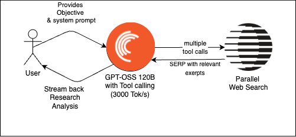

# Crafting a Full-Stack Search Agent using Parallel and OpenAI GPT-OSS 120B

[](https://uithub.com/janwilmake/parallel-search-agent?lines=false) [](https://remix.forgithub.com/janwilmake/parallel-search-agent)

In this guide, we'll show you how to build a Web Research Agent accessible over a simple frontend. By the end of this guide, you'll know how to build a search agent like in [this demo](https://x.com/janwilmake/status/1960652955251589355) (see the result at https://agent.p0web.com and try it as long as there's still Cerebras & Parallel credit left).

The Search Agent we're building will:

- Show a simple search homepage
- Allow user to edit system prompt in config modal
- Connect the agent with search through tool use
- Stream back searches, search results, AI reasoning, and AI responses
- Render that nicely as it comes in



The Technology Stack we'll use:

- [Parallel Typescript SDK](https://docs.parallel.ai/home)
- [Vercel AI SDK](https://ai-sdk.dev/docs/introduction)
- [Cerebras](https://ai-sdk.dev/providers/ai-sdk-providers/cerebras) for fast AI responses
- [Cloudflare Workers](https://workers.cloudflare.com) to deploy it

This guide shows how these different pieces work together and highlights the decisions of this architecture.

## Vercel AI SDK

These days, most AI providers ship their models with tool calling built-in. Some providers are starting to adopt the newer [responses API](https://community.openai.com/t/introducing-the-responses-api/1140929) that has more built-in functionality like MCP, but most providers aren't there yet and it's not clear if this will become the new standard. In this guide we're using GPT OSS 120B on Cerebras via a `/chat/completions` endpoint, the most standard way today to do AI inference.

Although `/chat/completions` is most standard, it's not most intuitive. Doing tool calling in a streaming fashion requires working with SSE and multiple back and forths to the API (steps) which is hard to get right. Also there, what if we want to change to a different provider, model or protocol later? Writing the code manually this might end up costing a lot of time if we used the raw API specification. Luckily, there's the Vercel AI SDK which elegantly abstracts away the provider-specific quirks and allows calling most providers with most of their features from a unified, well-documented interface.

In order to build our agent, under water the `/chat/completions` endpoint from Cerebras is called for every step. When a tool needs to be called (search in our case) it comes back and we execute that on our server-side, giving the output back to the model to continue inference.

The Vercel SDK allows doing this back and forth in a single fucntion call through defining a tool with an `execute` parameter:

```ts
// Define the search tool
const searchTool = tool({
  description: `# Web Search Tool

**Purpose:** Perform web searches and return LLM-friendly results.

**Usage:**
- objective: Natural-language description of your research goal (max 200 characters)

**Best Practices:**
- Be specific about what information you need
- Mention if you want recent/current data
- Keep objectives concise but descriptive`,
  inputSchema: z.object({
    objective: z
      .string()
      .describe(
        "Natural-language description of your research goal (max 200 characters)"
      ),
  }),
  // we'll define this later
  execute: undefined,
});
```

As you can see we're using zod to define the schemas. We also need the cerebras provider to use their models. All in all, we can install these 3 packages like so:

```sh
npm i ai zod @ai-sdk/cerebras
```

In order to prevent the famous `Type instantiation is excessively deep and possibly infinite. ts(2589)` Typescript error, zod requires specifying a version suffix. The packages and needed functions can be imported like so:

```ts
import { createCerebras } from "@ai-sdk/cerebras";
import { streamText, tool, stepCountIs } from "ai";
import { z } from "zod/v4";
```

After defining the tool we can use `streamText` to create a multi-step streaming agent like this:

```ts
// Initialize Cerebras provider
const cerebras = createCerebras({
  apiKey: env.CEREBRAS_API_KEY,
});

// Stream the research process
const result = streamText({
  model: cerebras("gpt-oss-120b"),
  system:
    systemPrompt ||
    `You are a simple search agent. Your mission is to comprehensively fulfill the user's search objective by conducting 1 up to 3 searches from different angles until you have gathered sufficient information to provide a complete answer. The current date is ${new Date(
      Date.now()
    )
      .toISOString()
      .slice(0, 10)}

**Research Philosophy:**
- Each search should explore a unique angle or aspect of the topic
- NEVER try to OPEN an article, the excerpts provided should be enough

**Key Parameters:**
- objective: Describe what you're trying to accomplish. This helps the search engine understand intent and provide relevant results.

**Output:**
After doing the searches required, write up your 'search report' that answers the initial search query. Even if you could not answer the question ensure to always provide a final report! Please do NOT use markdown tables. 
`,
  prompt: query,
  tools: { search: searchTool },
  stopWhen: stepCountIs(25),
  maxOutputTokens: 20000,
});
```

When using this, don't forget to add your [Cerebras API key](https://cloud.cerebras.ai/platform) to your `.env`:

```sh
CEREBRAS_API_KEY=YOUR_KEY
```

The tool is added to tools using `tools: { search: searchTool }`. Using `stopWhen` we're ensuring the agent does not stop after a single step but only after max 25 steps. By specifying `maxOutputTokens` you can prevent it from being too excessive.

After we have the result, we can respond with the full stream that contains all events by putting `result.fullStream` (which is an async iterable iterator) into a `ReadableStream`. Alternatively it's also possible to use Vercel's [UIMessage abstraction](https://ai-sdk.dev/docs/reference/ai-sdk-core/ui-message#uimessage).

```ts
// Return the streaming response
const encoder = new TextEncoder();
const stream = new ReadableStream({
  async start(controller) {
    try {
      for await (const chunk of result.fullStream) {
        const data = `data: ${JSON.stringify(chunk)}\n\n`;
        controller.enqueue(encoder.encode(data));
      }
      controller.enqueue(encoder.encode("data: [DONE]\n\n"));
    } catch (error) {
      console.error("Stream error:", error);
      controller.enqueue(
        encoder.encode(
          `data: ${JSON.stringify({
            type: "error",
            error: error.message,
          })}\n\n`
        )
      );
    } finally {
      controller.close();
    }
  },
});

return new Response(stream, {
  headers: {
    "Content-Type": "text/event-stream",
    "Cache-Control": "no-cache",
    Connection: "keep-alive",
    "Access-Control-Allow-Origin": "*",
    "Access-Control-Allow-Methods": "GET, POST, OPTIONS",
    "Access-Control-Allow-Headers": "Content-Type",
  },
});
```

## Executing the tool with the Parallel Typescript SDK

We designed our [Search API](https://parallel.ai/blog/parallel-search-api) for machines from first principles. It [beats competition](https://parallel.ai/blog/search-api-benchmark) in benchmarks. The key difference from other Search APIs such as Exa or Tavily, is that it gives all required context in a single API call, whereas other search agents still function the traditional way of search, where it's split up into 2 API calls - one for getting the SERP, one for getting the pages that seem relevant. This works too, but is usually a lot slower and more token-heavy for the LLM. Parallel smoothens this process and has build a system that finds the most relevant context of all pages immediately, but only the relevant stuff, to reduce context bloat.

The Parallel Search API allows fine-grained control over the type of input, the way it's processed, the sources that are included/excluded, and most importantly, how many output tokens will appear.

Our Typescript SDK can be installed using npm:

```sh
npm i parallel-web
```

Get your API key from [API Key Settings](https://platform.parallel.ai/settings?tab=api-keys) and put it in `.env`

```
PARALLEL_API_KEY=YOUR_KEY
```

For our search agent we're using the Search API to execute the tool call. Since we are looking to make a multi-step research agent with a smaller model (GPT OSS 120B) we'll keep the amount of results per search and the amount of characters per result small, preventing the context window to fill too quickly, and saving on cost.

```ts
import { Parallel } from "parallel-web";

const execute = ({ objective }) => {
  const parallel = new Parallel({ apiKey: env.PARALLEL_API_KEY });

  const searchResult = await parallel.beta.search({
    // Choose objective or search queries.
    // We choose objective here because it allows for a
    // natural language way of describing what you're looking for
    objective,
    search_queries: undefined,
    // "base" works best for apps where speed is important,
    // while "pro" is better when freshness and content-quality is critical
    processor: "base",

    source_policy: {
      exclude_domains: undefined,
      include_domains: undefined,
    },
    max_results: 5,
    // Keep low to save tokens
    max_chars_per_result: 800,
  });
};
```

## Serving this on serverless

In this guide we're using Cloudflare Workers to deploy the above code. We're bringing the AI SDK and Parallel Typescript SDK Code together and serve it at `POST /api/research` in [worker.ts](https://github.com/parallel-web/parallel-cookbook/blob/main/typescript-recipes/parallel-search-agent/worker.ts).

Using the following `wrangler.json` configuration, we are able to deploy this app using `wrangler deploy`. Node.js, the [wrangler CLI](https://developers.cloudflare.com/workers/wrangler/install-and-update/), and a Cloudflare account [are needed for this](https://developers.cloudflare.com/workers/get-started/guide/).

```json
{
  "$schema": "https://unpkg.com/wrangler@latest/config-schema.json",
  "name": "web-research-agent",
  "main": "worker.ts",
  "compatibility_date": "2025-07-14",
  "route": { "custom_domain": true, "pattern": "yourdomain.com" }
}
```

Before deploying, make sure to submit your secrets to the worker environment:

```sh
wrangler secret bulk .env
```

## Creating the frontend

We now have a public POST endpoint that is only ratelimited by our budgets for the Parallel API and the Cerebras API. In a production application you would add user authentication and limit based on your users plan, but for the purposes of this guide we're omitting that, and any frontend is able to consume our API.

As you can see in the worker code, we're also hosting an `index.html` and serving that at `GET /`:

```ts
import indexHtml from "./index.html";

// in your handler:
if (request.method === "GET" && url.pathname === "/") {
  return new Response(indexHtml, {
    headers: { "Content-Type": "text/html" },
  });
}
```

The HTML shows the search interface and after submitting a search, calls `POST /api/research` and renders the events coming back from the stream.

```js
async function startResearch() {
  const query = searchInput.value.trim();
  if (!query) return;

  showLoadingState();
  currentMode = "text";

  // Abort any existing request
  if (abortController) {
    abortController.abort();
  }

  abortController = new AbortController();

  try {
    const response = await fetch("/api/research", {
      method: "POST",
      headers: {
        "Content-Type": "application/json",
      },
      body: JSON.stringify({
        query: query,
        systemPrompt: currentSystemPrompt || undefined,
      }),
      signal: abortController.signal,
    });

    if (!response.ok) {
      throw new Error(`HTTP error! status: ${response.status}`);
    }

    const reader = response.body?.getReader();
    const decoder = new TextDecoder();

    if (!reader) {
      throw new Error("No response body");
    }

    let buffer = "";
    showResults(); // Show results interface when stream starts

    while (true) {
      const { done, value } = await reader.read();

      if (done) break;

      buffer += decoder.decode(value, { stream: true });

      // Process complete lines
      const lines = buffer.split("\n");
      buffer = lines.pop() || ""; // Keep the last incomplete line in buffer

      for (const line of lines) {
        if (line.startsWith("data: ")) {
          const data = line.slice(6);
          if (data === "[DONE]") {
            return;
          }

          try {
            const chunk = JSON.parse(data);
            handleStreamChunk(chunk);
          } catch (error) {
            console.error("Error parsing chunk:", error, data);
          }
        }
      }
    }
  } catch (error) {
    if (error.name === "AbortError") {
      console.log("Request was aborted");
    } else {
      console.error("Research error:", error);
      showError(`Research failed: ${error.message}`);
    }
  } finally {
    abortController = null;
  }
}

function handleStreamChunk(chunk) {
  switch (chunk.type) {
    case "text-delta":
      if (currentMode === "reasoning") {
        finalizeCurrentSection();
        currentMode = "text";
      }
      appendText(chunk.text || "");
      break;
    case "reasoning-delta":
      if (currentMode === "text") {
        finalizeCurrentSection();
        currentMode = "reasoning";
      }
      appendReasoning(chunk.text || "");
      break;
    case "tool-call":
      finalizeCurrentSection();
      addToolCall(chunk);
      break;
    case "tool-result":
      addToolResult(chunk);
      break;
    case "error":
      showError(chunk.error?.message);
      break;
    case "finish":
      finalizeCurrentSection();
      addFinishIndicator(chunk.finishReason);
      console.log("Research completed with reason:", chunk.finishReason);
      break;
  }
}
```

As can be seen in [index.html](https://github.com/parallel-web/parallel-cookbook/blob/main/typescript-recipes/parallel-search-agent/worker.ts), we are also using https://cdn.tailwindcss.com to use TailwindCSS and heavily reduce the lines needed to get nice styling. Other than that there are no dependencies! If you use React or other frontend frameworks, the [AI SDK UI](https://ai-sdk.dev/docs/ai-sdk-ui/overview) is a useful helper. Since I went with regular HTML, [this context](https://unpkg.com/ai@5.0.22/dist/index.d.ts) was needed to ensure the AI could easily generate the frontend based on the requirements. For more information on how I generated this entire app, see [this context guide](notes/context-guide.md).

## Result and considerations

The resulting agent can be found [here](https://agent.p0web.com) and the related source code can be found [here](https://github.com/parallel-web/parallel-cookbook/tree/main/typescript-recipes/parallel-search-agent). For demonstration purposes this recipe uses a very cheap and fast model: [GPT OSS 120B on Cerebras](https://www.cerebras.ai/news/cerebras-helps-power-openai-s-open-model-at-world-record-inference-speeds-gpt-oss-120b-delivers) ([Docs](https://inference-docs.cerebras.ai/models/openai-oss)). Although it's one of the fastest models on the market right now and is fully OSS, it should be noted that this model sometimes inacurately stops early during a search even though instructions instruct it differently. Also it sometimes tries to call tools that aren't there, which is likely due to overfitting on the tools it was trained on. In a production use-case it's likely better to go for a better tool-calling model that doesn't have these quirks yet is similarly speedy. Both [groq](https://groq.com) and [cerebras](https://www.cerebras.ai) provide such models and besides adding authentication and rate-limiting, this would be a good next step to making a production-ready search agent for your enterprise use-case.
