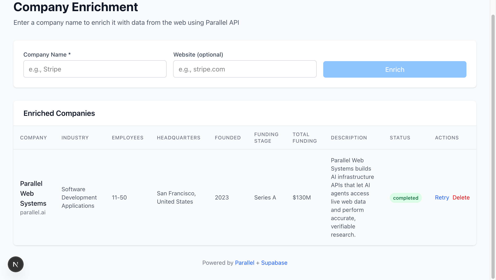

# Data Enrichment with Supabase + Parallel

Build a real-time data enrichment pipeline using [Supabase Edge Functions](https://supabase.com/docs/guides/functions) and [Parallel's Task API](https://docs.parallel.ai/task-api/task-quickstart).

This cookbook demonstrates how to create a Clay-like experience where users input minimal data (e.g., company names) and get back enriched information automatically.



## Why Supabase + Parallel?

| Feature | Benefit |
|---------|---------|
| **Zero infrastructure** | Supabase Edge Functions + Parallel = no servers to manage |
| **Real-time updates** | Supabase Realtime pushes enrichment results to the UI instantly |
| **Flexible schema** | JSONB storage adapts to any enrichment fields without migrations |
| **Cost-effective** | Pay only for what you use on both platforms |
| **Global edge** | Edge Functions run close to users, Parallel handles web research |

## Architecture

```
┌─────────────┐     ┌─────────────────┐     ┌─────────────────┐     ┌─────────────────┐
│   Web App   │────▶│  API Routes     │────▶│  Edge Function  │────▶│  Parallel API   │
│  (Next.js)  │     │  (Next.js)      │     │  (Supabase)     │◀────│  (Task API)     │
└─────────────┘     └─────────────────┘     └─────────────────┘     └─────────────────┘
       │                    │                       │                       │
       │  realtime          │  secret key           │  writes               │ researches
       ▼                    ▼                       ▼                       ▼
┌─────────────────────────────────────────────────────────────────────────────────────┐
│                              Supabase Database                                       │
│  ┌─────────────┐  ┌──────────────────────────────────────┐                          │
│  │  companies  │  │  enrichment fields (JSONB)           │                          │
│  │  - name     │  │  - industry, funding, employees...   │                          │
│  │  - website  │  │  - custom fields you define          │                          │
│  │  - status   │  │                                      │                          │
│  └─────────────┘  └──────────────────────────────────────┘                          │
└─────────────────────────────────────────────────────────────────────────────────────┘
```

### How It Works

1. **User submits** a company name (and optional website)
2. **Frontend** inserts a record with `status: pending`
3. **Frontend** calls a Next.js API route
4. **API route** invokes the Edge Function using the secret key (server-side)
5. **Edge Function** calls Parallel's Task API with a structured output schema
6. **Parallel** searches the web and returns structured data
7. **Edge Function** saves results to the database
8. **Supabase Realtime** pushes the update to the frontend
9. **UI updates** automatically with enriched data

## Quick Start

### Prerequisites

- [Supabase CLI](https://supabase.com/docs/guides/cli) installed
- A [Supabase project](https://supabase.com) (free tier works)
- A [Parallel API key](https://platform.parallel.ai)
- Node.js 18+

### 1. Clone and Set Up

```bash
# Navigate to the cookbook
cd typescript-recipes/parallel-supabase-enrichment

# Link to your Supabase project (config.toml is already provided)
# Find your project ref in: Dashboard > Project Settings > General > Reference ID
# Or from your project URL: https://supabase.com/dashboard/project/<project-ref>
supabase link --project-ref your-project-ref
```

### 2. Create the Database Tables

Run the SQL files in your Supabase SQL Editor (Dashboard > SQL Editor > New Query):

1. Copy and run `sql/01_create_companies.sql` (required)
2. Copy and run `sql/02_create_enrichment_columns.sql` (optional - for dynamic columns)

### 3. Set Up Secrets

```bash
# Set your Parallel API key as a secret
supabase secrets set PARALLEL_API_KEY=your-parallel-api-key
```

### 4. Deploy Edge Functions

```bash
supabase functions deploy enrich-company
supabase functions deploy poll-enrichment
```

### 5. Set Up the Web App

```bash
cd web

# Install dependencies
npm install

# Create environment file
cp .env.example .env.local
```

Edit `.env.local` with your Supabase credentials (Dashboard > Project Settings):

```
# From Data API > Project URL
NEXT_PUBLIC_SUPABASE_URL=https://your-project-ref.supabase.co
# From API Keys > publishable key (client-side)
NEXT_PUBLIC_SUPABASE_PUBLISHABLE_KEY=your-publishable-key
# From API Keys > secret key (server-side only)
SUPABASE_SECRET_KEY=your-secret-key
```

### 6. Run the App

```bash
npm run dev
```

Open http://localhost:3000 and start enriching!

## Project Structure

```
parallel-supabase-enrichment/
├── README.md                     # This file
├── sql/
│   ├── 01_create_companies.sql   # Main table with enrichment tracking
│   └── 02_create_enrichment_columns.sql  # (Optional) Dynamic column config
├── supabase/
│   ├── config.toml               # Supabase configuration
│   └── functions/
│       ├── enrich-company/       # Main enrichment function
│       │   └── index.ts
│       └── poll-enrichment/      # Background polling for long tasks
│           └── index.ts
└── web/                          # Next.js frontend
    ├── app/
    │   ├── api/
    │   │   ├── enrich/route.ts   # API route to call enrich-company
    │   │   └── poll/route.ts     # API route to call poll-enrichment
    │   ├── layout.tsx
    │   ├── page.tsx              # Main UI
    │   └── globals.css
    ├── lib/
    │   └── supabase.ts           # Supabase client + types
    ├── package.json
    └── .env.example
```

## Customizing Enrichment Fields

The enrichment schema is defined in the Edge Function. To change what data gets enriched:

### Option 1: Static Schema (Simpler)

Edit `supabase/functions/enrich-company/index.ts`:

```typescript
const outputSchema = {
  type: "object",
  properties: {
    industry: { type: "string", description: "Primary industry" },
    employee_count: {
      type: "string",
      enum: ["1-10", "11-50", "51-200", "201-500", "500+"],
      description: "Company size range"
    },
    headquarters: { type: "string", description: "HQ location (City, Country)" },
    // Add your custom fields here
    ceo_name: { type: "string", description: "Current CEO or founder name" },
    tech_stack: { type: "string", description: "Primary technologies used" },
  },
  required: ["industry", "employee_count", "headquarters"],
};
```

### Option 2: Dynamic Schema (Advanced)

Use the `enrichment_columns` table to define fields in the database:

```sql
INSERT INTO enrichment_columns (name, display_name, column_type, description)
VALUES ('ceo_name', 'CEO Name', 'text', 'The current CEO or chief executive');
```

The Edge Function will automatically build the schema from these definitions.

## Configuration

### Parallel Processors

The Edge Function uses `lite-fast` by default. See [processor options](https://docs.parallel.ai/task-api/guides/choose-a-processor) and [pricing](https://docs.parallel.ai/resources/pricing) to choose the right one for your use case.

```typescript
const taskRun = await parallel.taskRun.create({
  processor: "base", // Change processor here
  // ...
});
```

### Environment Variables

**Edge Functions** (set via `supabase secrets set`):
- `PARALLEL_API_KEY` - Your Parallel API key

**Web App** (in `.env.local`):
- `NEXT_PUBLIC_SUPABASE_URL` - Your Supabase project URL
- `NEXT_PUBLIC_SUPABASE_PUBLISHABLE_KEY` - Client-side key for database/realtime
- `SUPABASE_SECRET_KEY` - Server-side key for calling Edge Functions (never expose to browser)

## Handling Long-Running Tasks

The Parallel Task API may take longer than the Edge Function timeout (50s) for complex enrichments. This cookbook handles that with a polling pattern:

1. `enrich-company` starts the task and stores the `run_id`
2. If the task doesn't complete in time, it returns with `status: processing`
3. `poll-enrichment` runs periodically to check pending tasks
4. The frontend polls via API route (`/api/poll`) every 10 seconds

For production, consider using [Supabase Cron](https://supabase.com/docs/guides/functions/schedule-functions) to run `poll-enrichment` automatically instead of client-side polling.

## Troubleshooting

### "PARALLEL_API_KEY not configured"

```bash
supabase secrets set PARALLEL_API_KEY=your-key
# Redeploy the function
supabase functions deploy enrich-company
```

### Enrichment stuck on "processing"

Check Edge Function logs in the Supabase Dashboard (Edge Functions > enrich-company > Logs).

Or trigger a manual poll:

```bash
curl -X POST https://your-project.supabase.co/functions/v1/poll-enrichment \
  -H "Authorization: Bearer your-secret-key"
```

### Real-time updates not working

Ensure the table has realtime enabled:

```sql
ALTER PUBLICATION supabase_realtime ADD TABLE companies;
```

## Resources

- [Parallel API Documentation](https://docs.parallel.ai)
- [Parallel Task API Quickstart](https://docs.parallel.ai/task-api/task-quickstart)
- [Supabase Edge Functions Guide](https://supabase.com/docs/guides/functions)
- [Supabase Realtime](https://supabase.com/docs/guides/realtime)
- [parallel-web npm package](https://www.npmjs.com/package/parallel-web)

## License

MIT
