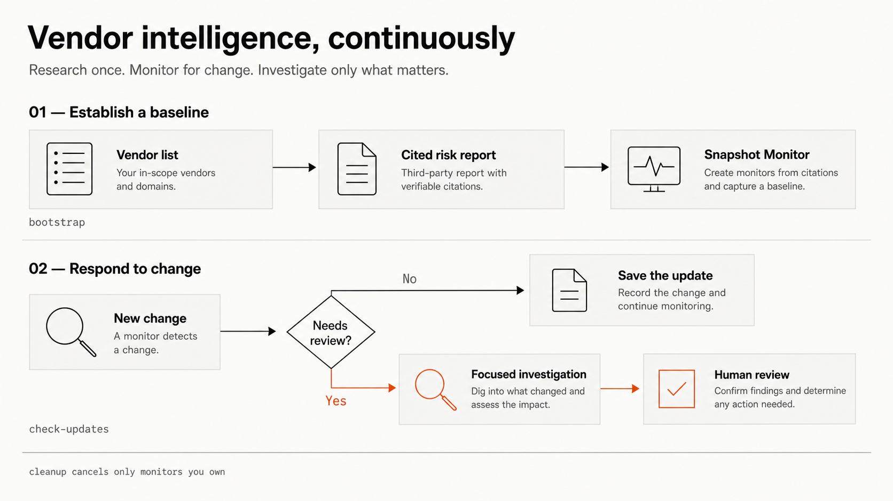

# Vendor intelligence with Parallel

Research a vendor once, monitor the same risk report for changes, and investigate only the changes that cross your review threshold.



This recipe uses the Parallel Task API and Monitor API through three local commands:

- `bootstrap` researches each vendor and starts a snapshot Monitor.
- `check-updates` reads new Monitor events and runs follow-up research when a change is material.
- `cleanup` cancels the Monitors recorded in this recipe's local state.

Parallel provides the researched evidence. The recipe validates that evidence and applies a deterministic risk policy, so the final risk level and human-review guidance do not depend on another model call.

## Quick start

You need Node.js 20 or newer and a [Parallel API key](https://platform.parallel.ai). `jq` is optional; it only formats the JSON output in the examples below.

```bash
git clone https://github.com/parallel-web/parallel-cookbook.git
cd parallel-cookbook/typescript-recipes/parallel-vendor-intelligence
npm ci
cp .env.example .env
chmod 600 .env
```

Add your key to `.env`:

```dotenv
PARALLEL_API_KEY=your-api-key
```

Keep `.env` private. It is ignored by Git.

The included vendor file contains one public company, Cloudflare. Create its baseline and Monitor:

```bash
npm run --silent bootstrap | jq
```

This command consumes credits. A normal first run can take a minute or two. It prints progress to stderr and one JSON result to stdout, so piping stdout to `jq` keeps the result readable.

A successful result includes the Task and Monitor IDs, the cited report, and the policy decision. The shortened example below uses sample values:

```json
{
  "vendors": 1,
  "baselinesCreated": 1,
  "monitorsCreated": 1,
  "results": [
    {
      "vendor": { "name": "Cloudflare", "domain": "cloudflare.com" },
      "baseline": { "action": "created", "runId": "trun_..." },
      "monitor": {
        "action": "created",
        "monitorId": "monitor_...",
        "frequency": "1d",
        "processor": "lite"
      },
      "assessment": {
        "risk": {
          "level": "MEDIUM",
          "requiresHumanReview": true,
          "guidance": "analyst_review"
        }
      }
    }
  ]
}
```

Leave the Monitor active if you want it to keep watching the vendor. Run the update check later, after the Monitor has had time to produce an event:

```bash
npm run --silent check-updates | jq
```

An empty `changes` list is a successful result; it means there are no new Monitor events to process. Running `bootstrap` again reuses the completed baseline and matching active Monitor.

When you are finished, cancel every Monitor owned by this recipe:

```bash
npm run --silent cleanup | jq
```

Do not delete `.vendor-intelligence/state.json` before cleanup. The state file tells the recipe which Monitors it owns.

## Use your own vendor list

`bootstrap` reads `examples/vendors.json` by default. Each entry needs a name and domain. `riskFloor` is optional:

```json
[
  {
    "name": "Cloudflare",
    "domain": "cloudflare.com",
    "riskFloor": "MEDIUM"
  }
]
```

Run the command with another file:

```bash
npm run --silent bootstrap -- --vendors /absolute/path/to/vendors.json | jq
```

The input must contain at least one vendor and cannot contain duplicate domains. Domains are normalized before any API call.

Bootstrap is additive: removing a vendor from the input file does not cancel its existing Monitor. Cancel one vendor explicitly with:

```bash
npm run --silent cleanup -- --vendor cloudflare.com | jq
```

Repeat `--vendor` to cancel several vendors. Run cleanup without flags to cancel all active Monitors recorded in local state.

## How the recipe controls cost

| Stage | Processor | When it runs |
| --- | --- | --- |
| Baseline research | `core` | Once for each new vendor or explicit retry |
| Snapshot monitoring | `lite` | At the configured Monitor frequency |
| Focused investigation | `pro` | Only when a changed risk field meets the review threshold |

A vendor `riskFloor` at or above `FOLLOW_UP_RISK_THRESHOLD` also triggers investigation for any changed risk field. Tasks and active Monitors consume Parallel credits. Completed Tasks remain in your account history and cannot be cancelled.

`check-updates` reports each processed event with its changed fields, current assessment, policy decision, and one follow-up status:

- `not_required`: the change did not cross the threshold.
- `pending`: follow-up research is still running.
- `completed`: the result includes confirmed facts, business impact, open questions, and citations.
- `failed`: the result includes the terminal Task ID and error.

## State and recovery

The recipe stores Task IDs, Monitor IDs, evidence, and processed event IDs in `.vendor-intelligence/state.json`. Writes are validated and atomic. A command lock prevents two lifecycle commands from changing the same state at once.

Commands are safe to repeat. A repeated command resumes a running Task, reuses a matching Monitor, and skips Monitor events it has already processed. Cleanup only cancels Monitor IDs found in local state.

If a command stops because of a timeout or temporary network error, run the same command again. If a Task reaches a terminal state such as `failed`, `cancelled`, or `action_required`, inspect the error before creating a replacement:

```bash
npm run bootstrap -- --retry-failed
npm run check-updates -- --retry-failed
```

The recipe does not automatically retry a request that creates a paid Task or Monitor. The API cannot safely tell whether a lost response created the resource, so an automatic retry could spend credits twice. If the state file is malformed, the recipe stops instead of silently resetting it. Back up the file and recover any recorded Monitor IDs before removing the state directory.

If a process stops while recovering a stale command lock, the error names the recovery-marker file. First confirm that no recipe command is still running. Then delete that file and run the command again:

```bash
rm -rf .vendor-intelligence/command.lock.reclaim
```

## Customize the policy

Only the API key is required. Two environment variables change the Monitor schedule and review threshold:

```dotenv
MONITOR_FREQUENCY=1d
FOLLOW_UP_RISK_THRESHOLD=HIGH
```

`MONITOR_FREQUENCY` accepts values from `1h` through `30d`. `FOLLOW_UP_RISK_THRESHOLD` accepts `LOW`, `MEDIUM`, `HIGH`, or `CRITICAL`.

The six risk dimensions live in [`src/schema.ts`](src/schema.ts). Aggregate risk and human guidance live in [`src/risk-policy.ts`](src/risk-policy.ts). Change those two modules to adapt the recipe to your organization's vendor policy.

## Test the recipe

The normal test suite makes no API calls:

```bash
npm run validate
npm audit --audit-level=high
```

The live test consumes credits. It researches Cloudflare with a real `core` Task, creates a `lite` snapshot Monitor, checks for updates, cancels the Monitor in cleanup, and confirms its remote status is `cancelled`:

```bash
npm run test:live
```

The Task API may print an advisory warning that the baseline could be too complex for the `core` processor. The command still validates the complete six-dimension report before it succeeds. If your own baseline fails validation or the evidence is not useful, simplify the report in [`src/schema.ts`](src/schema.ts) or change `baselineProcessor` to `pro` in [`src/vendor-config.ts`](src/vendor-config.ts).

The live test does not wait for a real vendor change. Deterministic tests cover the change-to-follow-up path.

## License

[MIT](LICENSE)
