# Vendor intelligence with Parallel

Build a cited vendor-risk baseline, keep it current with a snapshot Monitor, and run focused research only when deterministic policy marks a change as material.



This is a local reference implementation. It has one runtime, one state file, and three commands:

- `bootstrap` researches each vendor, scores the structured result, and creates one snapshot Monitor.
- `check-updates` processes unseen Monitor events once, records the changed assessment, and launches focused follow-up research when policy requires it.
- `cleanup` cancels only the Monitor IDs recorded by this recipe.

## Cost-aware flow

The recipe uses a narrow cost funnel:

| Stage | Processor | When it runs |
| --- | --- | --- |
| Structured baseline | `core` | Once for each new vendor |
| Snapshot monitoring | `lite` | At the configured Monitor frequency |
| Focused investigation | `pro` | Only when a changed field crosses the deterministic threshold |

Task Runs and active Monitors consume Parallel credits. Run `cleanup` when you finish evaluating the recipe. Task Runs are historical API resources and cannot be cancelled through the current public SDK.

## Quick start

Requirements: Node.js 20 or newer and a Parallel API key.

```bash
git clone https://github.com/parallel-web/parallel-cookbook.git
cd parallel-cookbook/typescript-recipes/parallel-vendor-intelligence
npm ci
cp .env.example .env
```

Set `PARALLEL_API_KEY` in `.env`, then run:

```bash
npm run bootstrap
npm run check-updates
npm run cleanup
```

`bootstrap` reads `examples/vendors.json` by default. Supply another file with:

```bash
npm run bootstrap -- --vendors /absolute/path/to/vendors.json
```

Each vendor has a name, domain, and optional deterministic risk floor:

```json
[
  {
    "name": "Cloudflare",
    "domain": "cloudflare.com",
    "riskFloor": "MEDIUM"
  }
]
```

Domains are normalized before any API call. The complete input must contain at least one vendor and no duplicate normalized domains.

## Expected output

The commands print machine-readable JSON. A first bootstrap resembles:

```json
{
  "vendors": 1,
  "baselinesCreated": 1,
  "baselinesReused": 0,
  "monitorsCreated": 1,
  "monitorsAdopted": 0,
  "monitorsReused": 0
}
```

Running `bootstrap` again reuses the completed Task and matching active Monitor. `check-updates` reports counts plus one `assessments` entry for every newly processed change. Each entry includes the current risk level, deterministic guidance, rules that fired, citation URLs, and follow-up status. An empty event page is a successful check.

`cleanup` prints the exact state-owned Monitor IDs it attempted and cancelled:

```json
{
  "attempted": ["monitor-id"],
  "cancelled": ["monitor-id"],
  "failures": []
}
```

## State and recovery

The recipe writes `.vendor-intelligence/state.json`. The file contains baseline Task IDs and citations, the latest deterministic assessment, Monitor ownership, event history, and resumable follow-up Task IDs. It is ignored by Git and atomically replaced after runtime validation.

Normal commands are safe to repeat:

- A saved baseline Task is awaited instead of recreated.
- A matching active snapshot Monitor is reused or adopted.
- Monitor events are deduplicated by stable event ID across process runs.
- A saved follow-up Task is resumed even if its Monitor event has left remote retention.
- Cleanup never lists the account or cancels a Monitor absent from local state.

If `state.json` is malformed, the recipe stops instead of resetting it. Back up and repair the file, or recover and cancel the recorded Monitor IDs before removing the state directory.

## Customize the policy

Only the API key is required. Two environment variables expose the teaching-level controls:

```dotenv
MONITOR_FREQUENCY=1d
FOLLOW_UP_RISK_THRESHOLD=HIGH
```

`MONITOR_FREQUENCY` accepts hours, days, or weeks from `1h` through `30d`. `FOLLOW_UP_RISK_THRESHOLD` accepts `LOW`, `MEDIUM`, `HIGH`, or `CRITICAL`.

The six risk dimensions live in one `RISK_DIMENSIONS` registry in [`src/schema.ts`](src/schema.ts). That registry drives prompt descriptions, runtime validation, Task JSON Schema, policy iteration, and citation grouping. Aggregate risk and human guidance live in [`src/risk-policy.ts`](src/risk-policy.ts); Parallel supplies researched evidence, while deterministic code owns organizational policy.

## Verify the current API contract

The normal suite is deterministic and makes no API calls:

```bash
npm run check
npm test
npm run build
npm audit --audit-level=high
```

The opt-in live test creates a real `core` Task and a disposable `lite` snapshot Monitor, retrieves its event page, and confirms cancellation in `finally`:

```bash
npm run test:live
```

The same contract can be run as a standalone probe with `npm run smoke:live`. Both commands consume credits. They do not wait for a real material change; deterministic fixtures cover that branch.

## Production extensions

Production systems can replace polling with webhooks, use event-stream Monitors for open-ended discovery, batch large portfolios with Task Groups, move state to a database, and route high-risk results to Slack or a ticketing system. Those are extensions, not additional execution paths in this recipe.

## License

[MIT](LICENSE)
